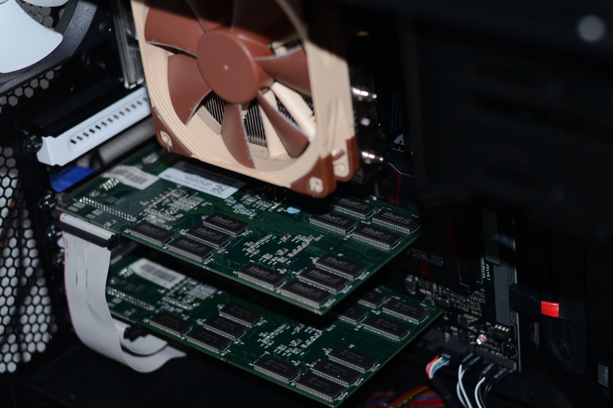

I published an article a while ago with the almost identical title. Just a little difference this time. SLI.

---

## Preparations

The main reason why I didn't test SLI last time is, that the PCI-connectors on my mainboard are not directly next to each other. The normal connector bridge cable is simply too short. So this time I used an old floppy cable, rotated the twisted lines back and rotated the inner four ones – and we have a Voodoo 2 SLI bridge.

## Comparing Results

After firing up Unreal Tournament that I recently bought from GOG, I noticed that the game was rendered on my main monitor that is not connected to the Voodoo 2. The render API is set to Glide and I am even able to choose resolutions above 1024 × 768. The Voodoo 2 can not do that. I assume GOG has patched in some kind of emulation in their version. But we want native Glide! The old installation patched to 436 of course works great again. And so does SLI – offering up to double performane. Check out the minimum framerates in UT in 800 × 600.

* Single 640 × 480: 13436 frames rendered in 229.79 seconds. Min 41.17 Max 60.11 Avg 58.46 fps (old data)
* Single 800 × 600: 13436 frames rendered in 279.92 seconds. Min 22.47 Max 60.35 Avg 47.99 fps (old data)
* SLI 640 × 480: 13436 frames rendered in 224.39 seconds. Min 48.98 Max 60.18 Avg 59.87 fps
* SLI 800 × 600: 13436 frames rendered in 225.03 seconds. Min 43.53 Max 60.65 Avg 59.70 fps
* SLI 1024 × 768: 13436 frames rendered in 249.03 seconds. Min 23.56 Max 60.30 Avg 53.95 fps

I tried overclocking the cards to improve the performance a little bit, but the registry method from back in the day didn't work. The effect would be very small anyways.

## More games!

The last time I experimented with the Voodoo 2 I only tried Unreal Tournament. If the Glide API is available it's a good sign that the Voodoo works because no other graphics cards have this API. There as dozens of Unreal Engine 1 based games available, but probably even as much with the Quake Engines. So I gave Quake 2 a try. After switching to the 3dfx Mini GL Driver, the monitor connected to the Voodoo 2 turned on and I was able to enjoy a 3dfx rendered image. Benchmarking was a must using the commands `timedemo 1` and `map demo1.dm2`.

* Single 640 × 480: 689 frames, 11.7 seconds: 59.0 fps
* Single 800 × 600: 689 frames, 12.5 seconds: 55.1 fps
* SLI 640 × 480: 689 frames, 11.7 seconds: 58.9 fps
* SLI 800 × 600: 689 frames, 11.6 seconds: 59.3 fps
* SLI 1024 × 768: 689 frames, 11.9 seconds: 58.0 fps

A single Voodooo 2 runs the game just fine, but if you need 1024 × 768 or perfect 60 fps in 800 × 600, SLI is the way to go! Btw: The Quake 2 version from GOG worked perfect here!

## Even more experiments

Windows 10 will stay for a while. But what if PCI slots vanish completly from modern mainboards? I will try out a PCI-to-PCI-e adapter soon to find out just how future proof our Voodoo 2 cards are.