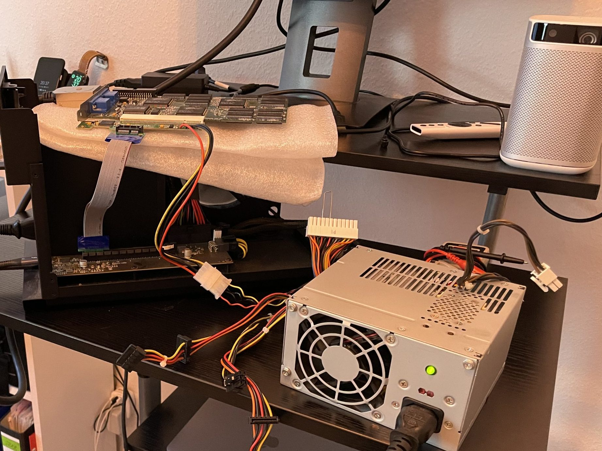
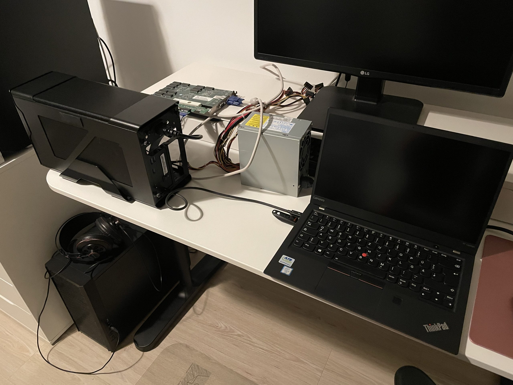

A bright future for the Voodoo2, even 23 years later

---

## Questionable Motivation

I’m fascinated by the idea of running a 3dfx Voodoo card in a modern system. While it might sound silly to some retro enthusiasts, for me it means preparing for a future when more and more time-appropriate hardware might fail simply because of age.
I already got a pair of Voodoo 2 running in a Windows 10 system a few years back when there were still mainboards with PCI slots.
My attempts back then to get them running using adapters in PCI-e slots where failing and I already gave up, thinking I hit the limit of what’s possible.

I now wanted to try one more thing and yes, it is possible to run a 3dfx Voodoo 2 from 1998 in any* system, even running Windows 11. How did I archive it?

[3dfx Voodoo 2 running as eGPU with Windows 11 (Youtube, german/franconian reaction)](https://youtu.be/EA3_3VouJYA)

## Years of Preperation

Many, many years ago I bought a PCI-2-PCI-e adapter [trying to speed up a Voodoo 5 PCI](https://www.voodooalert.de/board/forum/index.php?thread/18303-pci-2-pci-e-adapter-kurzreview/) and getting around the 32bit limitation of most PCI slots. While that did not work – the Voodoo still was performing like a Voodoo 5 PCI – this adapter can be used. [Others tend](http://www.3dfxzone.it/enboard/topic.asp?TOPIC_ID=16658&whichpage=23) to fail and only work for sound cards or other extensions cards, so I took extra care to pick [this specific one](https://www.ebay.de/itm/294204387076), boarding the PLX PEX 8112 chip.

This very adapter was used in my Windows 10 experiments but lead to no success. While it reported the Voodoo to the device manager and the driver could be installed, starting a game would result in the [“Mapmen returned an error when trying to map memory”](https://twitter.com/feinripp/status/888461321934602241), and my [testing back then ended](https://www.voodooalert.de/board/forum/index.php?thread/22494-3dfx-voodoo2-mit-windows-10/&postID=428484#post428484).

Just recently I bought myself a used ThinkPad Carbon X1 Gen5, for some light coding on the couch. My first Intel based system in a while and the first one with Thunderbolt port. I like the trend of eGPUs that got popular when Thunderbolt became more broadly available. A friend of mine uses such setup for gaming, he has the Razer Core X.

## It just works™

I still had the PCI Adapter laying around, so why not just try. From the beginning on I said the chances of it failing are 90%. So you can image my surprise when the old Voodoo once again displayed the Unreal Tournament intro through the VGA cable! This messy setup using an array of adapters somehow worked and I don’t know why. I understand Thunderbolt as an extension of the PCI-express, but it must be different.

## Even more findings

Immediately I wanted to get an own eGPU enclosure that would house one or even two Voodoo 2 cards. While there are many options and I thought about the [Akitio Node Duo](https://duckduckgo.com/?q=akito+node+duo&ia=web) or the [Echo Express III-D](https://www.sonnettech.com/product/echo-express-3d/overview.html), I then decided to go for the Cooler Master MasterCase EG200. The board in this one leaves some space under the second Slot so a PCI riser cable would fit. I also like that I could provide Molex power from the included power supply. But it does not work unfortunately, prompting an error “glide2x.dll expected voodoo graphics, none detected”, no matter what I tried. I’m a little sad and think it is because this eGPU enclosure has a [different controller chip (JHL7440 vs DSL6540 of the Razer Core X)](https://egpu.io/best-egpu-buyers-guide/).

But my testing is already finished at that point. I do know that the Razer Core X does work and I’m pretty sure it would work with any Intel system. AMD systems are slowly starting to have Thunderbolt ports too, and the next generation of Zen Architecture will support it natively.