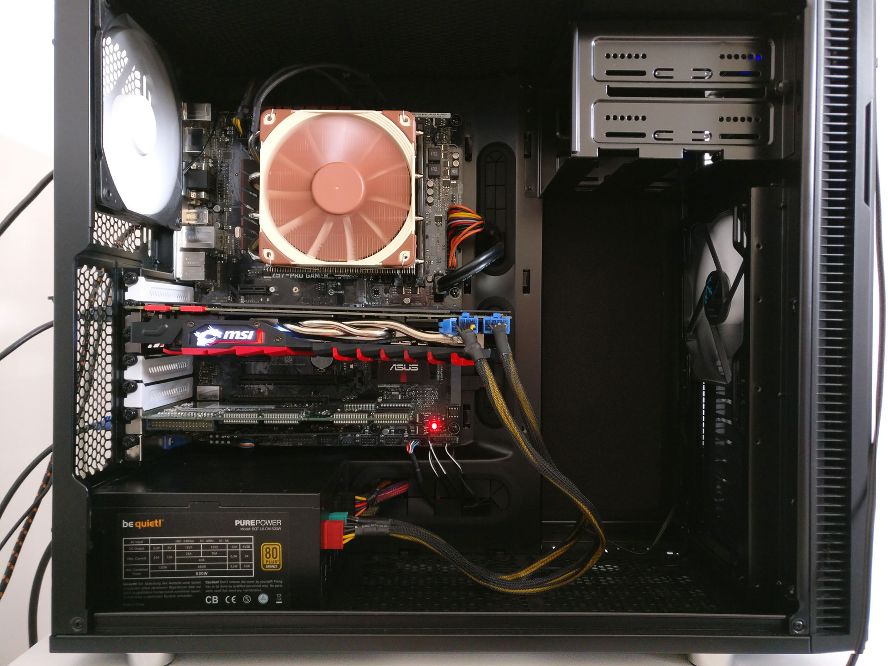
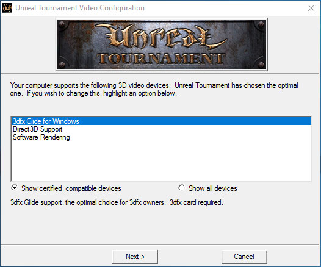
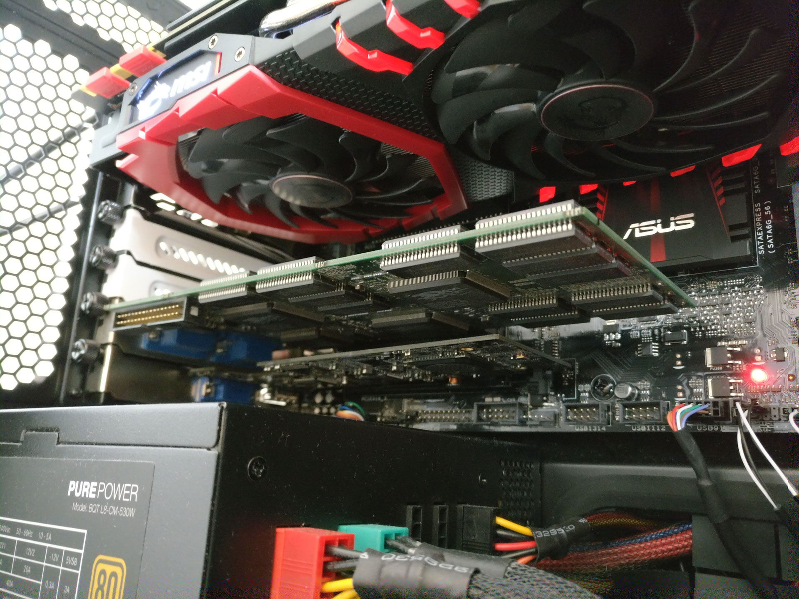

Using 20-year-old hardware in a today's PC to play some oldschool shooters. A 3dfx Voodoo 2 far away from home

---

*Note: SLI is working as well. I wrote about it [here](https://robertkrau.se/posts/3dfx-voodoo-2-sli-with-windows-10).*

## Searching for a need

Last week [some websites wrote](http://www.pcgameshardware.de/3dfx-Voodoo-Hardware-255488/News/Voodoo-5-5500-laeuft-unter-Windows-10-1218801/) about a forum thread about a user getting a Voodoo 5 5500 working with Windows 10.

I recreated the conditions and reported on it in the german [VoodooAlert forum](http://www.voodooalert.de/board/index.php?page=Thread&postID=408998#post408998).

In my opinion it’s an interesting experiment but doesn’t make much sense since there are no drivers which allow use of the great Glide API and we do not know what is emulated and what is done by the actual GPU.

I still liked the idea of using a 3dfx card in a modern system to enjoy some old classic games running Glide without emulation. So I digged further into the topic. For Voodoo 3, 4 and 5 cards there are drivers for Windows XP 64bit ([SFFT 1.9](http://www.3dfxzone.it/news/reader.php?objid=16199)). I already found out that these aren’t working with Windows 10, even if you try to force the installation of the unsigned driver. Then i stumbled over a forum thread about a really early Windows XP 64bit Voodoo 2 driver in the [3dfxzone.it forum](http://www.3dfxzone.it/enboard/topic.asp?TOPIC_ID=16033). But the download link is down. I finally found a working link in a [russian forum](http://www.old-games.ru/forum/xfa-blog-entry/3dfx-voodoo-2-windows-7-64bit.3164/) and believe it’s the same file.

Well – it does work!

## Setting up worlds from different ages

My current PC has the following components:

* Intel Core i7 4790K
* MSI Geforce GTX 1070 GAMING X 8 GB
* Corsair Vengeance LP schwarz DIMM Kit 8GB, DDR3-1600, CL9-9-9-24
* Asus Z97-PRO GAMER

As you can see the Voodoo 2 finds place in a PCI slot next to it’s PCI-express descendant – which is 18 years younger!  There is also a AverMedia C127 Game Broadcaster HD which can capture the VGA signal from the Voodoo. This way I can show you actual footage recorded with the Voodoo 2 in the Windows 10 PC.

To install the driver you need to disable the driver signature enforcement of Windows 10. It’s described [here](https://answers.microsoft.com/en-us/insider/forum/insider_wintp-insider_devices/how-do-i-disable-driver-signature-enforcement-win/a53ec7ca-bdd3-4f39-a3af-3bd92336d248?auth=1#ThreadAnswers) how to do that. Note that you have to do that everytime you want to use the Voodoo. Afterwards you can manually install the driver. Check out the following video to see how. Here you can download the driver [mirrored on my webhost](https://robertkrau.se/wordpress/wp-content/uploads/files/voodoo2%20win7x64.rar), in case that the other link goes down.

[3dfx Voodoo 2 Windows 10 Driver Install – YouTube](https://www.youtube.com/watch?v=Ip-MgiV0A14)

## Running the Unreal Tournament benchmark

The Glide renderer is available to select and after starting the game the Voodoo 2 is doing the work. Definitely a special moment to have gotten this combination to work.

To quantify the performance of the system – especially of the driver I ran the [timedemo “benchmark”](http://alt.3dcenter.org/downloads/unreal-tournament-benchmark.php) using these [guidelines](http://alt.3dcenter.org/userbench/unreal-tournament.php). Color depth is set to 16 bit with max details applied.

Here are the results:

* 640 × 480: 13436 frames rendered in 229.79 seconds. Min 41.17 Max 60.11 Avg 58.46 fps
* 800 × 600: 13436 frames rendered in 279.92 seconds. Min 22.47 Max 60.35 Avg 47.99 fps

[3dfx Voodoo 2 Windows 10 UT Benchmark – YouTube](https://www.youtube.com/watch?v=IYQ5t-TlgAw)

## There is some work to do

I personally think this is a great milestone for 3dfx fans – but there is still some potential left.

Besides Unreal Tournament I did not test any other games. So I can’t say anything about the game compatibility of the driver I used.

I wasn’t able to test SLI since the two PCI slots on my board are not directly next to each other. A longer custom made loop cable would help. If you don’t have any PCI slots on your mainboard anymore you can try using a PCI-to-PCI-e adapter. I did a [(german) review](http://www.voodooalert.de/board/index.php?page=Thread&postID=312622) a few years ago. You can get them on ebay for very little money.

There is even a driver for Voodoo 1 cards and 64bit systems [available](https://wenchy.net/old/glidexp/). I don’t have my Voodoo 1 in my apartment right now to test it out, but will do so in the future if the community hasn’t done it by then already.

It would be amazing if the talented driver programmers would find motivation to put some effort into making drivers for the newer cards compatible with Windows 10. Because after all these years, do not forget, 3dfx Voodoo cards are…

> So powerful, it's kind of ridiculous.
>
> 3dfx (1994-2000)