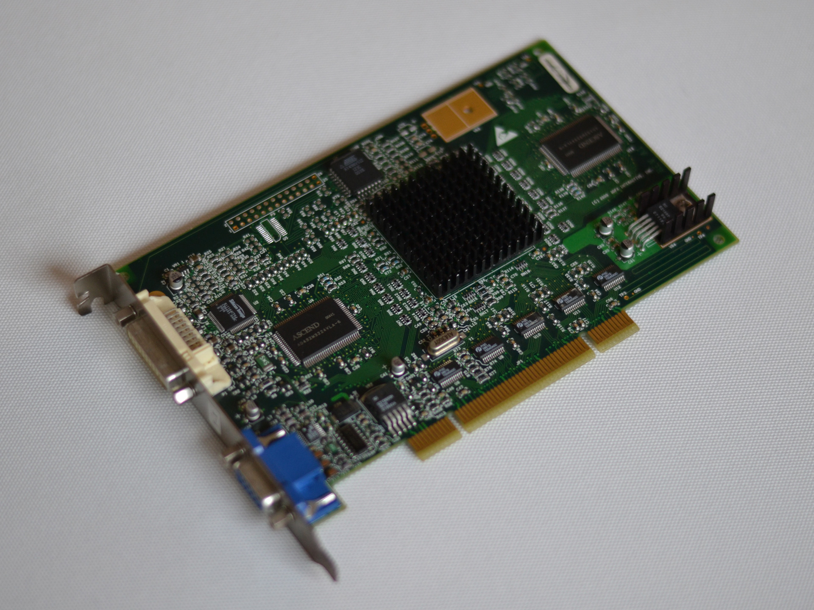
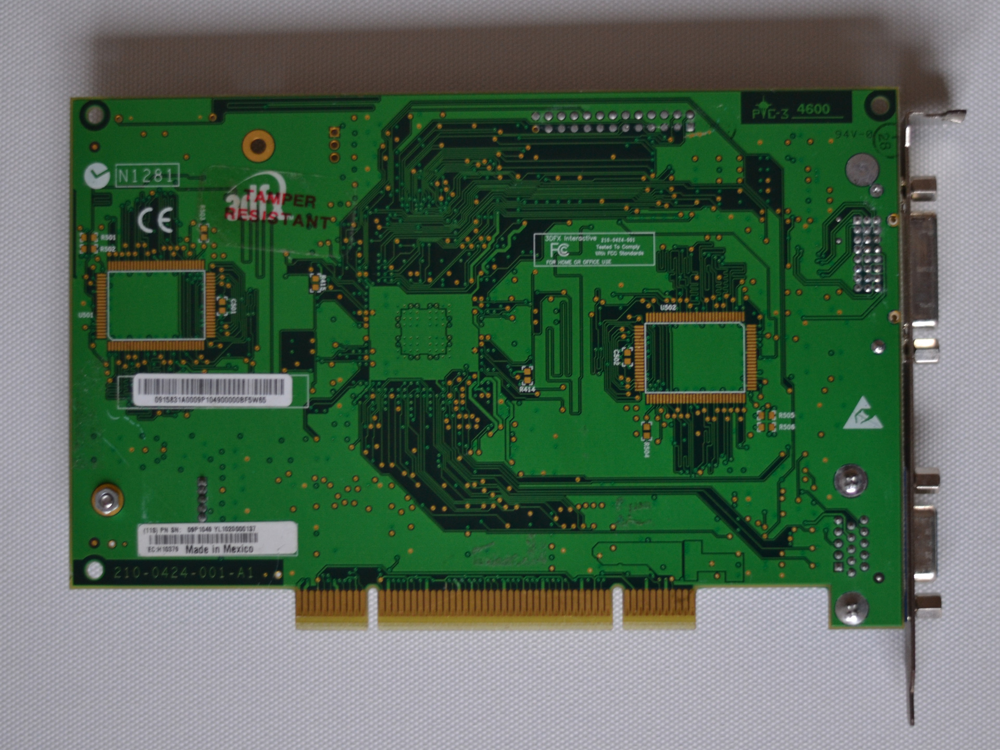

Recently I was lucky to buy this card on ebay. It is extremly rare and unique so I think it's worth writing about

---

## Some history

What makes this card so rare, is the fact that it was manufactured by 3dfx very close before going out of business. It never got into hands of end consumers, there are only prototypes and cards that went into IBM servers. My card is such one.

It is unique because it has the VSA-101 chip, an evolution of the VSA-100 with a smaller manufacturing process and the ability to address DDR-Memory. 0.18µm help the chip to stay cooler and in fact not rely on active nor passive cooling.

Equipped with just 16 MByte videomemory we can’t expect to see exceptional performance. What I personally did not except were the huge driver and game compatiblity issues.

Specs gathered:

* VSA-101
* 16 MByte DDR-SG RAM
* PCI Interface
* D-SUB and DVI
* 2 × AA

Information about this card is seeded sparse, everything I found is from here:

* [https://www.forumzone.it/showthread.php?t=14795](https://www.forumzone.it/showthread.php?t=14795)
* [http://www.thedodgegarage.com/3dfx/pro_daytona.htm](http://www.thedodgegarage.com/3dfx/pro_daytona.htm)

I put the card into my [3dfx Voodoo Retro PC](https://robertkrau.se/posts/3dfx-voodoo-retro-pc/) and tried games and benchmarks with Windows 98 and Windows XP. I did not compare it to other cards but might add comparisons to Voodoo4 and Voodoo3 at a later point.

## Windows XP

I tried Windows XP first because I stumbled about working drivers for it first, which is the [NuDriver 2K "X^2"](http://nuangel.net/NuDrivers/) from NuAngel.

Windows XP is not the OS to use with a Daytona. The only game I got running without any issues is Need for Speed Porsche.

Quake 3 was running with slightly offset colors as long as I didn’t change the settings.

Surprisingly 3DMark worked, at least sometimes:

* 3DMark 2000: 2663
* 3DMark 2001: 1297

Every other game I tested is not playable:

* Quake (extrem graphic issues)
* Operation Flashpoint (extreme graphic issues)
* Carmageddon II (only DX, Glide error on startup)
* Unreal Tournament
* Unreal
* Serious Sam (extreme issues, hangs after few seconds)

## Windows 98

Windows 98 it the go-to OS for running Voodoos but things are a little different with the Daytona. I tried so many driver, amongst them

* Amigamerlin 2.9
* 1.04
* x3dfx 1.07

None of these worked. The only driver I found working is the one in Gary Donovan’s [Daytona article](http://www.thedodgegarage.com/3dfx/pro_daytona.htm).

3DMarks are working and I got Unreal Tournament to run, so we have some number which give a rough idea of the performance of the card.

* 3DMark 2000: 2636
* 3DMark 2001: 838

Unreal Tournament:

* 640 × 480 0×AA: 13436 frames rendered in 160.60 seconds. Min 47.86 Max 118.22 Avg 82.62 fps
* 800 × 600 0×AA: 13435 frames rendered in 230.18 seconds. Min 32.63 Max 82.31 Avg 58.36 fps
* 1024 × 768 0×AA: 13436 frames rendered in 324.72 seconds. Min 24.38 Max 61.94 Avg 41.37 fps
* 1280 × 1024 0×AA: 13436 frames rendered in 513.73 seconds. Min 16.29 Max 40.30 Avg 26.15 fps
* 1600 × 1200 0×AA: 13436 frames rendered in 729.15 seconds. Min 9.50 Max 28.45 Avg 18.42 fps
* 640 × 480 2×AA: 13436 frames rendered in 297.99 seconds. Min 24.25 Max 67.59 Avg 45.00 fps
* 800 × 600 2×AA: 13436 frames rendered in 425.87 seconds. Min 18.25 Max 47.46 Avg 31.54 fps
* 1024 × 768 2×AA: 13436 frames rendered in 650.25 seconds. Min 9.87 Max 32.72 Avg 20.66 fps

Looking at the average frames by the standards of around 2000 the Daytona was able to run Unreal Tournament in 1024 × 768 without Anti Aliasing or 800 × 600 with 2 x AA.

## Conclusion

The 3dfx Daytona is not a card anybody should obtain to game. The available drivers are very immature which leads to permanent freezes, reboots, compatiblity issues and subpar and unexpected performance. In fact it feels a lot more like a prototype than the Voodoo5 6000 does. So much that I was too frustrated to continue benchmarking and eventually did not compare it to older Voodoos.

It’s a fascinating piece of tech and maybe a small glimpse of what 3dfx would have to offer to compete in other regions than just performance.