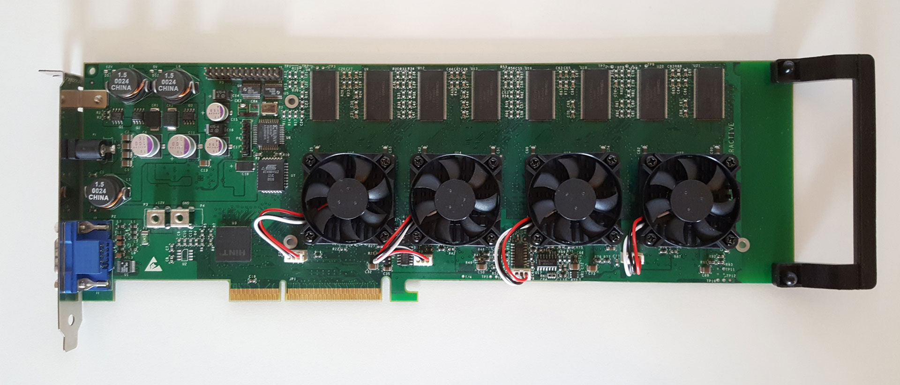
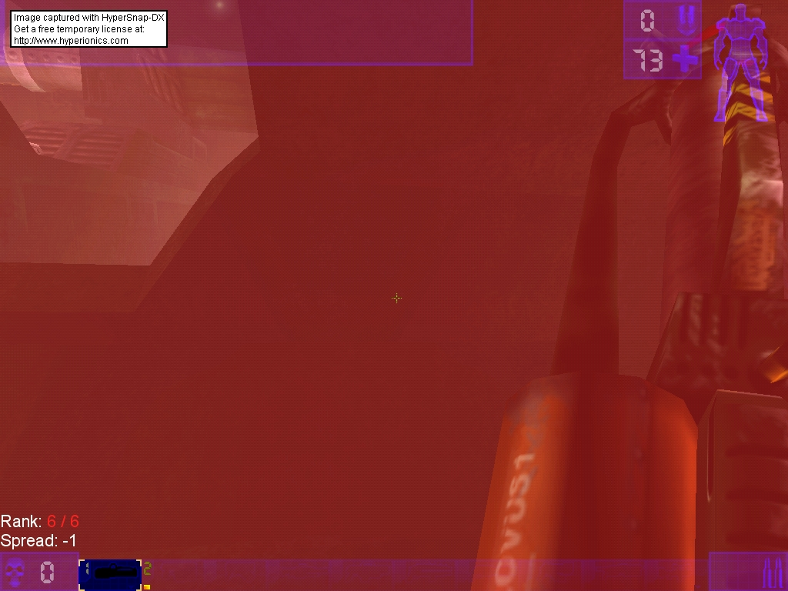

Must one accept a moderate annoyance or is there help? Studying the legendary 3dfx Voodoo 5 6000 and it's quirks

---

*Note: Shortly after writing this article I got in contact with [@oscar_barea](https://twitter.com/oscar_barea) who is a huge 3dfx-collector and has repaired many Voodoo5 6000. He was able to find the hardware defect and managed to fix it thanks to his great abilities. He described the process in great detail in the [voodoo3dfx.com](http://www.voodoo3dfx.com/Foro_V6k/viewtopic.php?t=475) forum.*

> prototype (ˈprəʊtəˌtaɪp)\
> one of the first units manufactured of a product, which is tested so that the design can be changed if necessary before the product is manufactured commercially
>
> Collins English Dictionary

## Unfortunate Observations

This is not an article about the 3dfx Voodoo 5 6000 in general. It’s about a very specific problem.

Ever since I have this card, this issue exists. Basically in some settings horizontal stripes become present in the rendered image, sometimes almost not visible, other times extremely noticeable. Later on in the article you will see examples of this in a video I captured. My Rev A3 3400 has many reworks on it, which differ from the standard PCI rework most of the Voodoo 5 6000s have.

I use it in this system (I should write an article about that alone):

* AMD Athlon XP-m 2600 @ 2,5 GHz
* 1 GByte Corsair DDR-333
* EPoX 8K5A2+
* Soundblaster Audigy 2 ZS
* Windows 98 SE unofficial SP

## Documenting the issue

The issue appears with

* Fastest Performance (0 × AA)
* 2 × AA

And it is gone with

* Single Chip Only
* 4 × AA
* 8 × AA

It does NOT matter which

* resolution
* color depth
* refresh rate
* driver
* OS
* render api*

Just for the sake of completeness I want to mention that the following video was recorded running the Amigamerlin 2.9 driver. Most of the clips where done in 16 bit, some might be 32 bit.

I was using a pretty long VGA cable connecting the Voodoo and the capture card, so the video quality is mediocre. You should get an idea of the problem anyways.

[3dfx Voodoo5 6000 A3400 – stripe artifacts – YouTube](https://www.youtube.com/watch?v=0JRbXwk_iW4)

As you can see the stripes become very visible when the brightness is increased. It almost seems there is a brightness threshold from when the errors occurs.

## A shimmer of hope

Things become interesting when I capture a screenshot. Using an old version of hypersnap it’s possible to grab frames from glide games. Once again UT is running in 1024 × 768 with 0 × AA. The stripes I would expect under those circumstances have vanished. Hypersnap grabs the content of the framebuffer (backbuffer) and does the filtering and gamma correction. Does this information help to localize the issue?

I do have a suspicion about whats wrong, but I want to get suggestions from the community. What information do you need? Details about the rework? Do not hesitate to contact me, I would be very thankful.