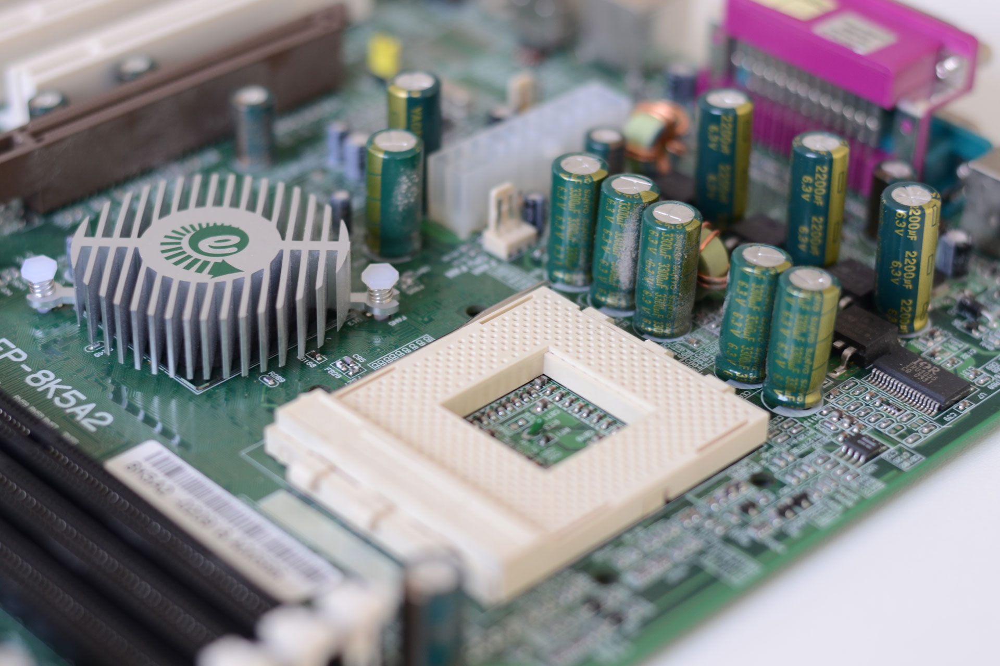
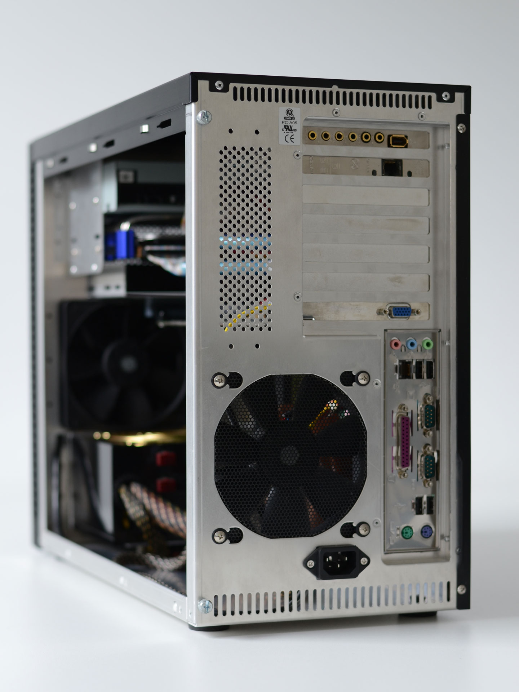

Can a perfect 3dfx Voodoo Retro PC be built? I built mine.

---

* CPU: AMD Athlon XP-m 2600+ @ 2,5 GHz (15×166 MHz)
* CPU Cooler: Zalman CNPS 7000B-Cu
* Mainboard: EPoX 8K5A2+ (VIA KT333)
* RAM: 2 × 512 MByte Corsair XMS 3200 DDR400 @ 333 MHz 2-2-2-5
* Graphics: 3dfx Voodoo 5 6000 3400A
* Sound: Creative Audigy 2 ZS
* NIC: Intel PRO 1000/GT
* HDD: Seagate Barracuda 7200.10 80 GByte
* ODD: LG DVD
* PSU: Enermax Liberty DXX 400 Watt
* Case: Lian Li PC-A05
* Monitor: Elsa Ecomo 24H96
* OS: Windows 98 SE

## Processor

The AMD Athlon XP-m 2600+. I bought so many samples of this processor to finally find one that can be overclocked as much as I need it to. Without increasing the voltage too much of course. To permanently fix the CPU multiplier I did the conductive silver modification on back of the socket.

The processor has a default clock of 2000 MHz. Most times I run it at 2500 MHz (15 × 166 MHz; default voltage) which is more than enough even for the most demanding games of the era. But I can raise the clock even further to almost 2800 MHz if I also increase the voltage.

## Mainboard

The famous EPoX 8K5A2+ is a Socket A Board that provides 3.3 volts AGP voltage. It’s popular amoungst 3dfx enthusiasts since it’s known as 100% Voodoo 5 6000 compatible.
The chipset cooler is replaced by a the CNB-S1 from Enzotech – 80 gramms of copper.

Some of the capacitors are poor quality electrolytic ones. They tend to pop and then need to be replaced.

I CNC milled a cooler for the mainboard mosfets to ensure more stable overclocking.

Pretty hard to get your hands on that board these days so I bought a spare one in 2016.

## RAM

One of the newer additions to the system these memory sticks facinated me already back in the days. Two Gigabyte of G.Skill F1-3200PHU2-2GBZX got replaced by 2 × 512 MByte Corsair XMS 3200. This RAM indicates the memory load with colored LEDs. Neat.

## Graphics Card

I build this system to have the most optimized basis for 3dfx Voodoo cards. the Voodoo 5 5500 is the fastest card from 3dfx produced for consumers. Once again I CNC milled – this time a massive aluminum cooler that covers both of the VSA-100 chips and the VRAM on the front side of the card. Overclocking up to 200 MHz is possible with a volt-mod. Quite a jump from the stock 166 MHz.

But that is only my back up card. Because I have the most legendary graphics card in the world in this system – the 3dfx Voodoo 5 6000. A prototype that never made it to market and the final masterpiece from 3dfx housing four VSA-100 chips and 128 MBytes of VRAM. Breathtaking specs for the Year 2000 and so ambitious it could never be sold.

## Soundcard

To reduce load on the processor I decided to install a dedicated soundcard. The installed Creative SoundBlaster Audigy 2 ZS supports Windows 98 and EAX. Sometimes outstanding soundeffects are the result.

## Case and Cooling

The Lian Li PC-A05 is a special case because the mainboard ist rotated 180°. This way the graphics card can be seen better. I removed the HDD cage from the case and placed the HDD in a 5,25″ slot. This way there is space for a little mount I CNC milled to hold the 6k. I also removed the connector on top of the case since I don’t use them which cleans up the case even more.

## OS, Software and Tuning

I’m running Windows 98 on this PC. German speaking people who plan to install this OS should follow this [excellent guide](http://www.voodooalert.de/board/index.php?page=Thread&threadID=22510&pageNo=1) from Tweakstone from the german VoodooAlert forum.

I might add some other details here later.

## Benchmarks

I did benchmark the system with 3dMark2001, Quake 3 following [these instructions](http://alt.3dcenter.org/userbench/quake3.php) and Unreal Tournament following [these instructions](http://alt.3dcenter.org/userbench/unreal-tournament.php):

**3DMark01SE**\
1024×768 32 bit: 3750

**Quake III Arena v1.32**, four.dm_68\
1024×768 16 bit: 168,3 fps (**without** WickedGL)

**Unreal Tournament V451**, benchmark\
1024×768 16 bit: 13436 frames rendered in 99.08 seconds. Min 64.73 Max 239.19 Avg 135.60 fps