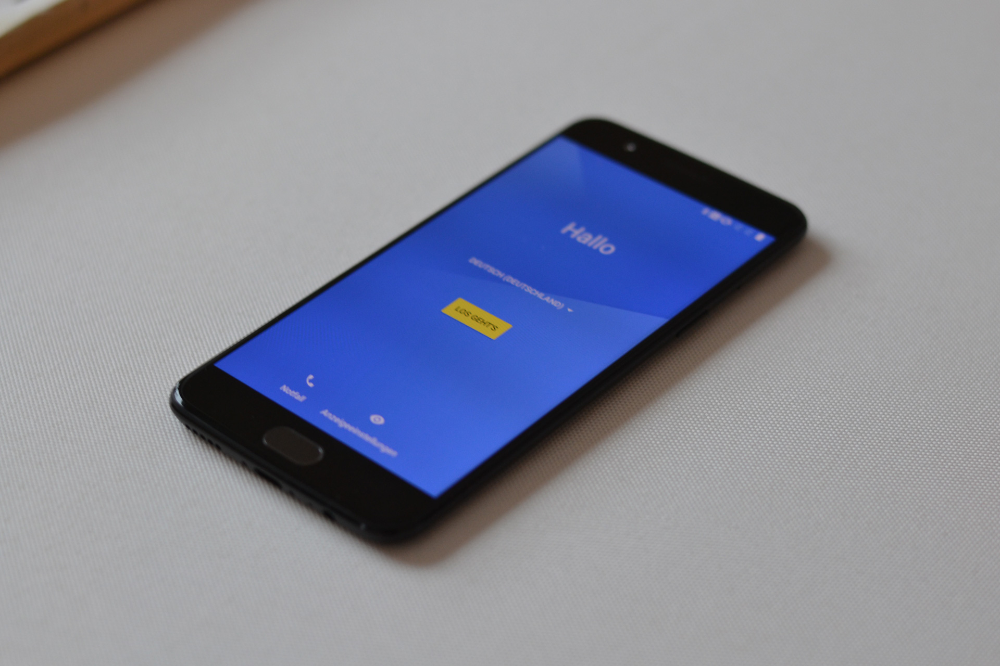

I curated the very best of Android apps for my usage profile

---

## Leaving Android for now

I am forcing myself to stay open minded towards software platforms and in general. That way I can judge about tech as objective and informed as possible. Also, as of Fall/Winter 2017, Apple offers the most attractive smartphone package for me. Therefore I will leave Android for now, which i used nonstop since 2012. I will go into detail about my decision, if that is not of interest for you – skip the rest of the paragraph.

Until now I was using the Oneplus 5. A phone that is high end in almost every way. But there are some compromises that prevent me from loving this phone. And I don't hesitate to leave things that I do not love.

the screen – The screen has a resolution of 1920*1080 pixel with a pentile panel. I do see the difference after owning WQHD phones (Galaxy S5 and S6). The display on the Oneplus 5 also has the "jelly effect" since it's mounted upside down.
the camera – Praised at the launch event and earned high marks from DxO but disappoints in praxis. Post processing adds an effect that is best described as oil painting. So you have to shoot RAWs. Those aren't supported with portrait photos and pictures taken with the tele lens. Why? OnePlus fails to deliver enthusiast features in an enthusiast's phone.
the software – Maybe a surprising point on this list since OnePlus ships an almost bloatfree version of Android and has great ROM support from the community. But flashing a ROM these days become less and less of an option since the quality of photographs depend a lot on the camera apk. Also OnePlus fails to ship a current version of Android months after launch but instead stumbles from one privacy scandal to the next.

## The Apps

Amaze – An Open Source, Material Design File Manager. The most useful feature for me is the ability to host a ftp server, so you can copy over files wirelessly.

Fenix2 (or Flamingo) – A 3rd party twitter client is a must if you want to cut down on tracking and want a chronological view of the tweets. These two are the best available.

Barcode Scanner – Since the most native camera apps still haven't implemented a QR-reader I found this one to be the best. It hasn't been updated for a while, so it doesn't bring a round icon, but it's free and fulfills all requirements.

Chromer – Opens links in a fast chromium webview.

Keepass2Android – The must have keepass client on Android. Supports every database host you can think of and has a good looking material design, which is rare amongst those enthusiast apps.

Nextcloud – I have moved away from Dropbox and Google Drive because I want to have total ownership and want to backup data without having to pay a regular fee. The Nextcloud app brings access to my files at all times and even allows to automatically upload my taken photos.

DAVdroid – Required to sync my contacts and calendar appointments. Free on F-Droid, a little fee in the Play Store.

Nova Launcher Prime – I have learned to love the option to hide apps, remove labels, change the grid, notification icons and much more.

PassAndroid – A free and adfree app with material design that allows to manage your e-tickets. I don't like the fumbly swipe to trash/archive behavior, though.

PocketCasts – I have bought this app on every platform to sync my podcast progress everywhere.

Pulsar or Phonograph – I hate the Google Play Music App with it's permanent annoyance of asking to subscribe. I also don't understand why the have to show the album covers as round icons. These two offer a great alternative.

Simplenote – This app is not always installed on my phone, but by including it in this list I have the opportunity to express my love for this tool. A clean notes app that comes with support for all platforms and even has installable clients on Windows and Mac. Beautifully composed lists can be shared for collaborative composition and than published as a minimalist website via link.