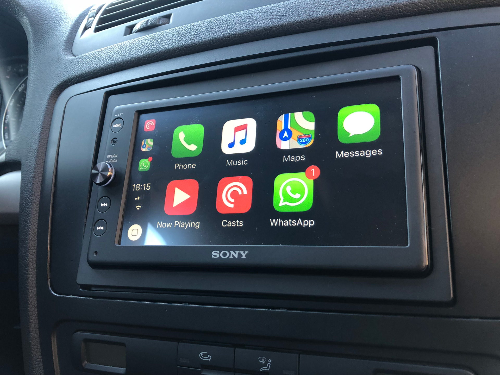

I have waited way too long. In hindsight every day without it was a dull experience. I'm of course talking about an aftermarket car stereo.

---

## Setting things up

My Skoda Octavia II from 2006 which I have since 2015 iirc comes with an receiver that doesn't even support MP3-CDs, let alone music files from USB. That is why I was still burning Audio-CDs in 2017. I now own a [Sony XAV-AX100](https://www.sony.de/electronics/in-car-empfaenger-player/xav-ax100) which costs 300€ here in Germany and I'm convinced it's worth the money.

Installing the unit is easy given you got the right adapters beforehand and have a basic understanding of technology which probably is the case if you are interested in a CarPlay receiver and read this blog. The adapters I'm using were 25€ from eBay and even include some bezels for the interior.

## Buying a second hand car is hard right now

A lot of new cars these days have CarPlay and Android Auto built in which is a gift from heaven, because car manufacturers' design languages seems to be stuck at glossy, chrome Skeuomorphism - except Tesla of course. These guys know what they are doing. What I want to say is that you are in a bad position if you own a car that was produced after manufacturers stopped using DIN-receivers and before they realized that there are companies that understand infotainment better than them.

## My Apple CarPlay experience

Let's get a litte bit more specific about CarPlay. Right off the bat: It's not the seamless experience known from iOS these days. In fact it feels restricted very much like iOS in its early years. Only some third-party apps work, for example the excellent PocketCasts. But you are stuck with Apple Maps [which is a lot inferior to Google Maps](https://www.justinobeirne.com/google-maps-moat). Music purists who still have a library of MP3s must use Apple Music – which requires iTunes – or Google Play Music – which is just an ugly app in my opinion.
But these are compromises I'm willing to make. Because the rest of experience is mostly great. From the get-go it is clear that UX-experts have developed the interface. Everything just makes sense. There are some hiccups now and then, for example the inability to change music albums when you are in an area without data receiption. But CarPlay is a software product and will improve over time, so complaints are obsolete.

It is required to activate Siri to use CarPlay. I wasn't too excited in the beginning – mainly because I didn't believe in voice recognition too much. But that has changed since. While you are able to use most aspects of CarPlay without Siri – with the exception of WhatsApp – I use it all the time now. You can even set the Siri language independent from the system language. Excellent.

## Looking forward

I'm looking forward to further improvements to CarPlay and the competition because CarPlay has brought back a little joy to driving around in a country of outdated infrastructure and outdated drivers. Autonomous driving can't happen soon enough.