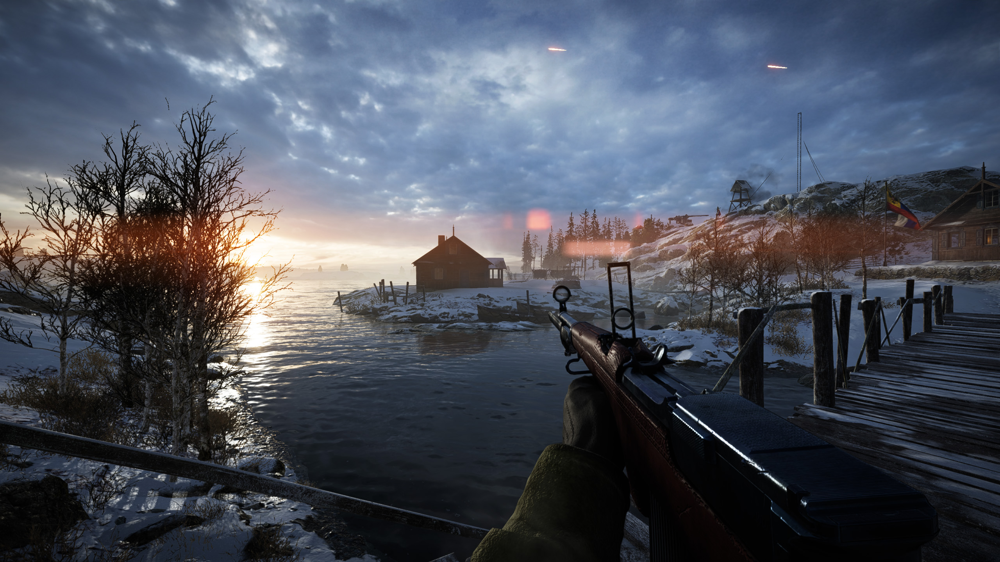
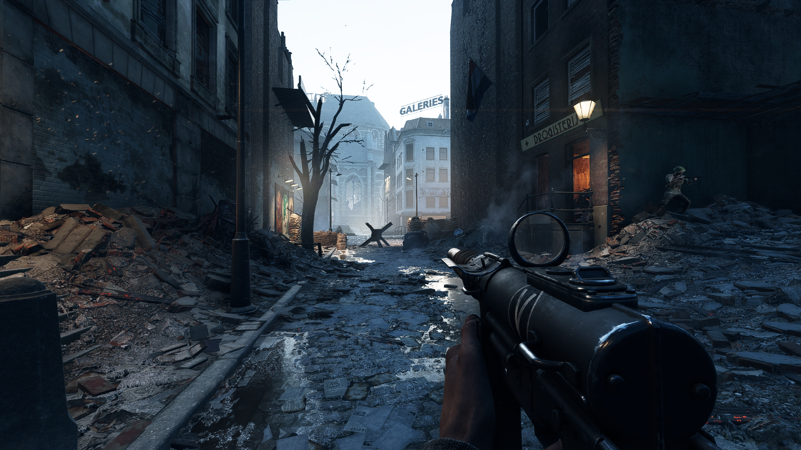

What I personally would like to see from the next Battlefield title after playing since Bad Company 2

---

## Tech

No doubt that the next Battlefield will use Frostbite once again. Since this will be a next-gen-only title I hope for a upgrade to a much newer version of Frostbite with new features.

The Zen 2 based processors in the new consoles will be so much faster than current gen tech. I hope this will lead to much greater multithread utilization in BF6 and also allow for new visual features or physics effects.

When it comes to Raytracing, I like the approach that DICE had with Raytracing in BF V. Making it optional for those that have enough performance headroom, but not providing a completely different visual presentation to standard rendering. Unfortunatelly the reflections just weren't a good fit for the setting. An urban setting with many puddles on the ground and buildings covered in glass that reflect streetlights would be a better fit. I also like the implementation in Modern Warfare, where raytracing offers much more realistic shadows.

Battlefield 5 still has these very annoying stuttering issues which are probably caused by inconsistent frametimes. Many people probably don't notice and this is maybe not the case on consoles and other machines. I demand this to be fixed in the next title.

## Setting

Modern day scenario but I also would like a cold war scenario which would help to differentiate from Battlefield 3 and 4 and some COD titles. No fantasy / alternative history timeline which the core audience very much dislikes.

## Gameplay

* No invisible threats like mortar
* Gunplay like Battlefield 5
* Weapon customization like BF4 with real attachments
* Destruction plays a bigger role in gameplay once again like in Bad Company 2, but on a more fine grained level
* Realism when it comes to gunplay but tone it down in other aspect where it hinders fun, like getting in and out of vehicles, attrition, revive animation

## Microtransactions

Microtransactions and Skins are fine in BF5, but could be a little altered. Make some archievable by just playing, others by completing specific tasks, and some purchasable with either in game grind currency or real money. Lootboxes are a no go. I also dislike skin bundles like in Modern Warefare where there will always be stuff included that you don't want.

## Other

* UI that focuses on UX rather than visual minimalism
* Usage of Battlfield Companion App to do customization
* Achievments that track all the time
* no Free2Play. Cheaters and kids destroy the atmosphere
* Matchmaking but having a bigger focus on server browser and community games. The longevity of the game will benefit

Even if Battlefield 5 was a disappointment in many aspects I still had a lot of fun with it.  The next title can only be better and I'm very much looking forward to it!