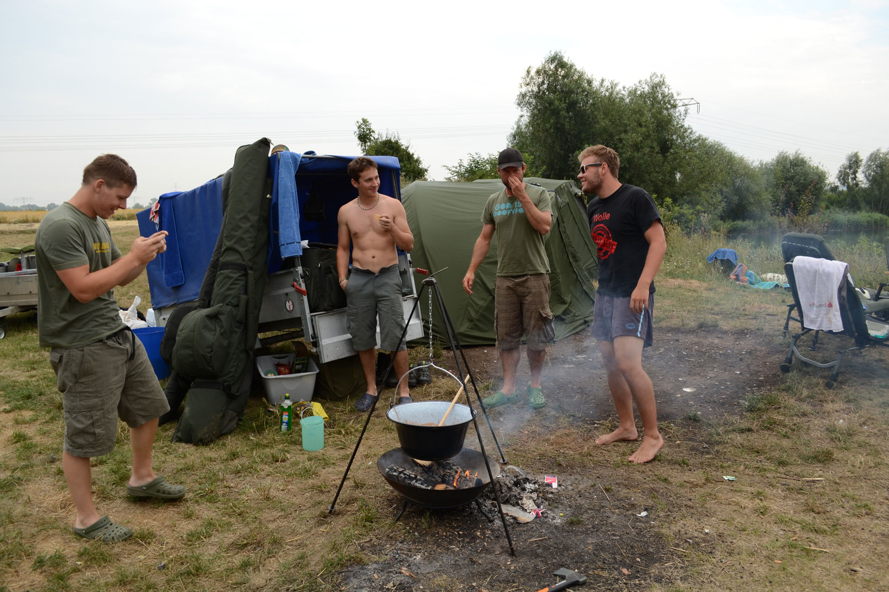

A video of one week carp fishing with the Carpteam Franconia in Germany. Some nice catches included

---

[Carpteam Franconia – Augusttrip 2013 – YouTube](https://www.youtube.com/watch?v=IjYWp0ZRQ4A)

## Some background information

Back in 2013 when my focus was not into webdevelopment yet, I considered filming and editing as a career. This fishing video is definitely my most ambitious project – and one of the rare cases where I’m really happy with the result.

It’s filmed with my Nikon D3100 and a GoPro Hero 3 Silver Editon. Some of the GoPro shots are done by my fishing buddies. The Lenses I used with the Nikon are a 50mm 1:1.8 and the 18 – 55mm 1:3.5 – 5.6 Kit Lens. The Nikon D3100 really is not ideal for filming beyond amateur levels. Fixing the shutter speed is a hassle.

Everything is heavily color-corrected with Adobe After Effects, the editing is done with Premiere Pro CS5. The whole post processing consumed a lot of evenings for the span of around half a year.