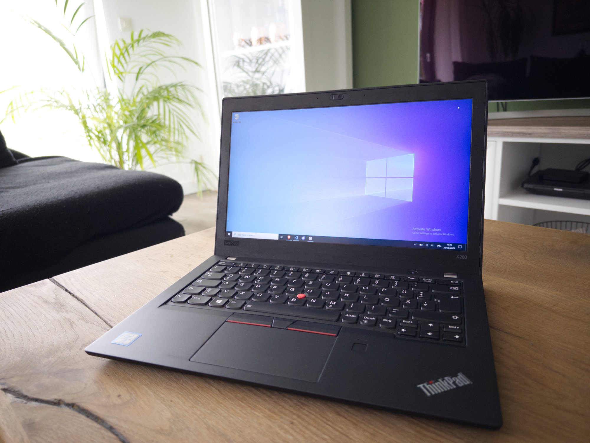

Installing Windows 10 in the most clean way possible without breaking stuff

---



Just recently I got myself a used Lenovo Thinkpad x280 for 140€. I want to use it for some light productivity tasks without having to boot up my main computer. It came preinstalled with Windows 11. My gaming rig still uses Windows 10, I only tried out Windows 11 once before it releases. While I like the design improvements, to me it still feels slower and less responsive than Windows 10. Also Microsoft puts too much bloatware into the operating system. I really believe Microsoft offers a bad product here. So I had to act, having these options in mind:

* Windows 11 (slimmed down)
* Windows 10 (slimmed down)
* Linux, e.g. Ubuntu

In the end I decided to go for a Windows 10 install for these reasons: Microsoft does not offer a installer for Word and Excel for Linux and Windows 11 basically offers nothing of additional value to me compared to Windows 10 but is slower.

Windows 10 does have quite a few unneeded components as well and getting rid of those can be done with a few different options, some of them are:

* [AtlasOS](https://atlasos.net/)
* [Tiny11](https://github.com/ntdevlabs/tiny11builder) (if I had gone for Windows11)
* [Chris Titus Tech’s Windows Utility](https://github.com/ChrisTitusTech/winutil)
* Windows LTSC

I decided to go for Windows 10 LTSC IoT 2021 here since I like the idea of it being “perfect” out of the box. Information around this version of Windows can be found when searching for massgrave. Can be installed with a local acount as well.

After installation, the start menu really looks empty compared to a normal installation and also RAM uage is low on my 8 GByte Thinkpad. A few additional things I did for my setup.

1. Setting up winget: This [tutorial](https://github.com/muradbu/winget-script?tab=readme-ov-file) show how to setup winget on a LTSC install without having to use the Windows Store. winget actually is one really great addition to the ecosystem.

2. Getting rid of Edge can be done with this [script](https://gist.github.com/ishad0w/3b79bf829e9725aa102b2e8446bb5ef8).

3. Installing only the wanted needed Microsoft 365 components with the [Micosoft 365 Deployment Tool](https://learn.microsoft.com/en-us/microsoft-365-apps/deploy/overview-office-deployment-tool). With this configuration only Word and Excel will be installed (I also installed OneDrive, but many people do not like it)

```xml
<Configuration>
    <Add OfficeClientEdition="64">
        <Product ID="O365ProPlusRetail">
            <Language ID="de-de" />
            <ExcludeApp ID="Access" />
            <ExcludeApp ID="Groove" />
            <ExcludeApp ID="InfoPath" />
            <ExcludeApp ID="Lync" />
            <ExcludeApp ID="OneNote" />
            <ExcludeApp ID="PowerPoint" />
            <ExcludeApp ID="Project" />
            <ExcludeApp ID="Publisher" />
            <ExcludeApp ID="SharePointDesigner" />
            <ExcludeApp ID="Visio" />
            <ExcludeApp ID="Teams" />
            <ExcludeApp ID="Outlook" />
            <ExcludeApp ID="OneDrive" />
        </Product>
    </Add>
</Configuration>
```

I quite happy with the install now and if works well in the next weeks I will probably do the same on my gaming/main rig.