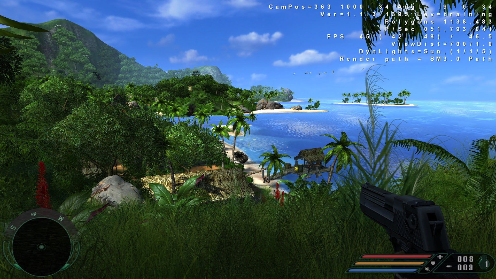
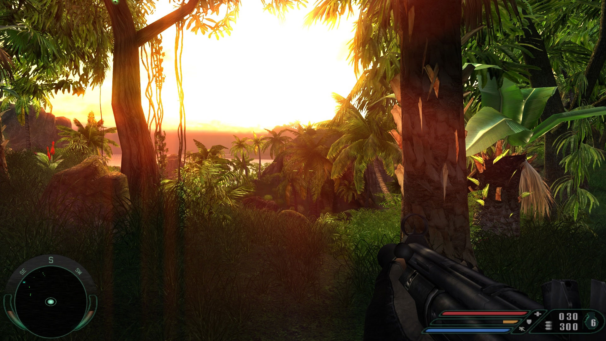
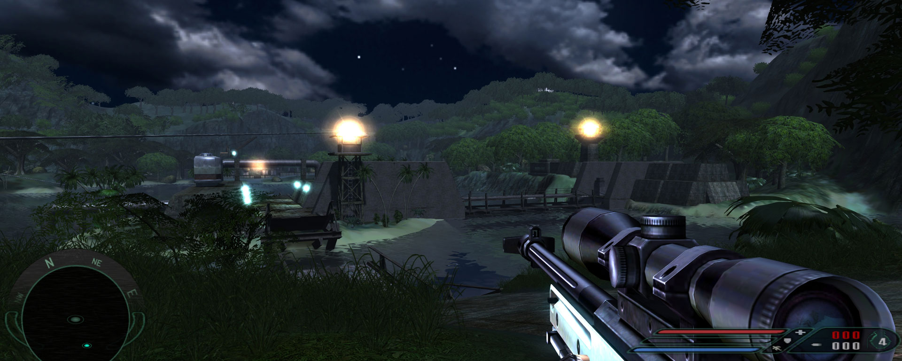
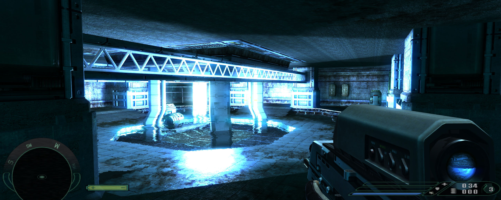
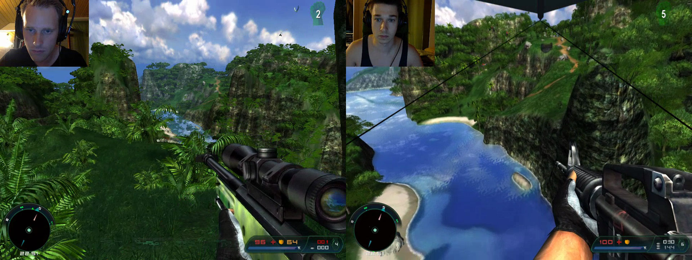

Released in 2004, Far Cry is a graphical milestone that does a perfect composition of open world and classic gameplay elements

---

## Requirements

First of all, we want to patch the game to an ideal version, so install these patches:

* [Patch 1.3](http://patches.ubi.com/far_cry/far_cry_v1.3.exe)
* [Patch 1.31](http://patches.ubi.com/far_cry/far_cry_v1.31.exe)
* [Patch 1.33](http://patches.ubi.com/far_cry/far_cry_v1.33.exe)

optional:

* Patch 1.4 cumulative from version 1.3x
* Patch 1.4 standalone

The 1.4 patch fixes mostly multiplayer aspects of the game and might cause issues regarding ragdoll and enemies seeing through walls in singleplayer, so I would recommend not to use it.

I highly recommend to install the [FC 64ecu to 32os conversion](http://www.nexusmods.com/farcry/mods/502/) so you get some additional effects, better textures, improved physics and more wildlife. The actual 64bit patch is not needed.

If you run Windows XP x64 you can install the

* farcry_amd64upgrade_us_uk.exe
* farcry_amd64_ecu

no other patches are needed, and I did not get it to run on any other OS than XP x64. If you have trouble finding those patches, drop me a message.

Far Cry runs best on Windows XP, but Windows 7 and 10 are also working with some compromises like missing water reflections. Also startup times can be extremly long. Watch the videoguide of [PhilsComputerLab](http://www.philscomputerlab.com/).

[Far Cry GOG.com review – YouTube](https://www.youtube.com/watch?v=9WZqHLyB-hQ)

Tuning

You should consider a 4:3 resolution, otherwise the hud elements will be stretched, mainly visible at the compas and sniper hud.

You can enable HDR by typing the following command into the console:

`/r_hdrrendering 7`

## Useful links

There is tons of other tweaking possible, so check out these excellent guides:

* [german tuning guide on pcgameshardware.de](http://www.pcgameshardware.de/Far-Cry-dt-Spiel-23146/Tests/Far-Cry-1-meets-Far-Cry-3-Test-Benchmarks-618290/)
* [tweakguides.com guide](http://www.tweakguides.com/Farcry_1.html)

## Coop

Unlike Far Cry 4, the other parts of the franchise don’t have the possibility to play the singleplayer in coop mode. Thanks to some modders, there are attempts to add this feature to the original Far Cry. None of these mods are perfect, but [Contest Island Invasion Mod](http://www.moddb.com/games/far-cry/addons/contest-island-invasion-v22295) is the best. Next to the coop aspect there are some visual changes, that I’d prefer not to have. But here comes the real bad news: Only a few levels work.

* Level 1: Training
* Level 2: Carrier
* Level 3: Fort
* Level 4: Pier
* Level 5: Research
* Level 15: Catacombs
* Level 16: River
* Level 17: Swamp
* Level 18: Factory
* Level 19: Dam
* Level 20: Volcano
* Check out some coop gameplay with my buddy (german audio):

[Far Cry Coop Splitscreen – Level 2 Carrier – german – YouTube](https://www.youtube.com/watch?list=PL0leCs_9l6kmevm1o5WPElbO2Ay0RwWi2&v=_UEjSBWdab8)