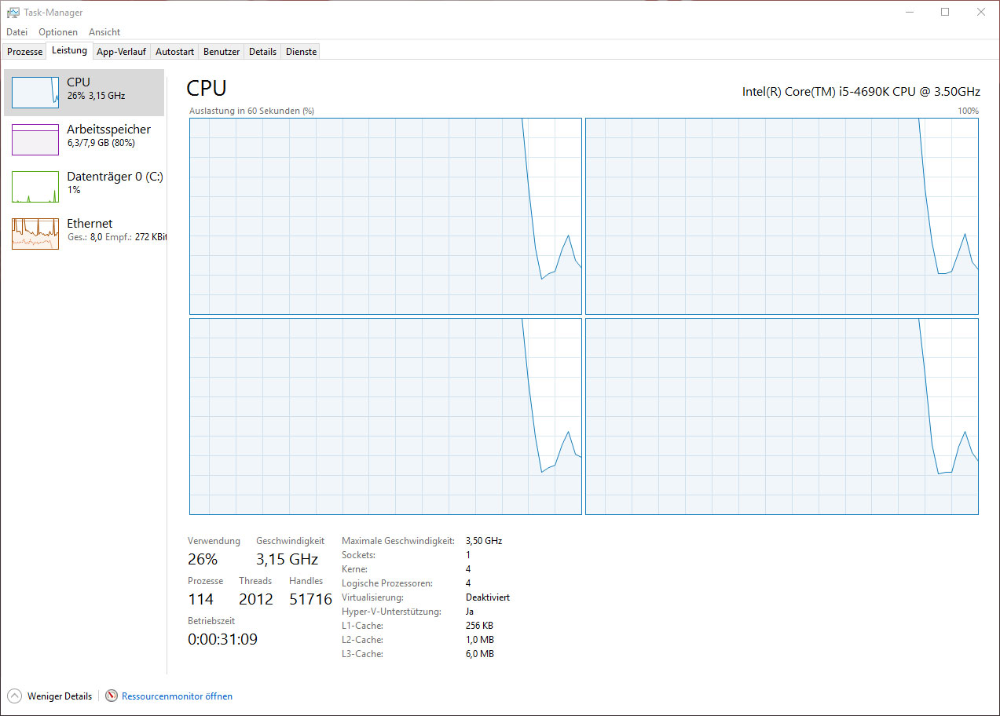
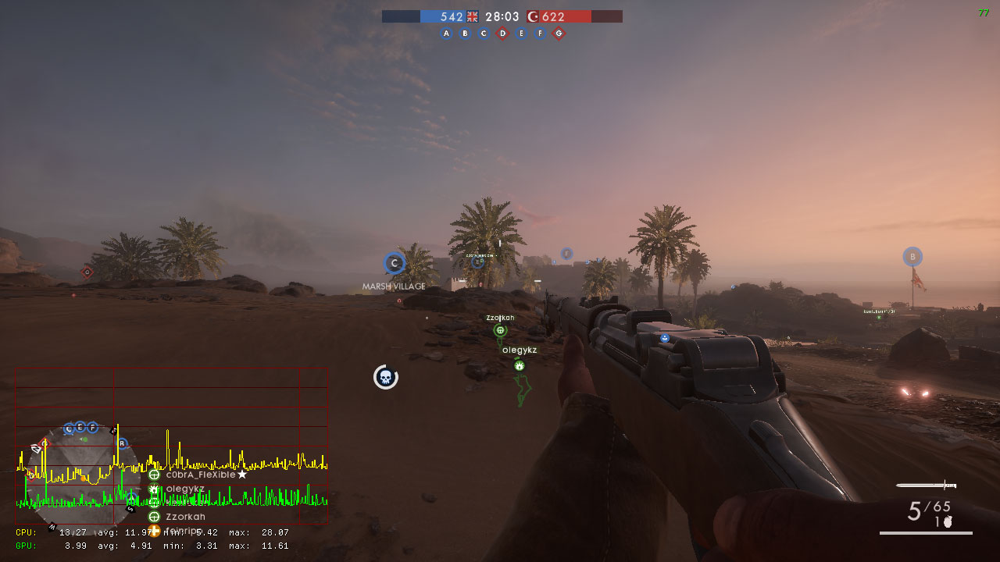
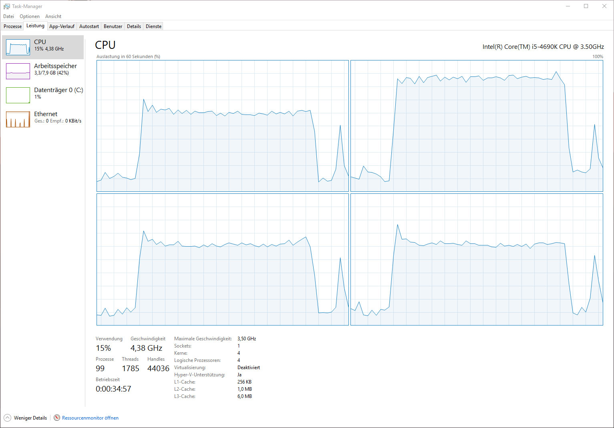

Battlefield 1 has some CPU issues. No, there is no workaround

---

*Note: DICE is aware of this issue. It is marked as fixed as of the release of Update 11152016, but the problem persists for many users.*

*Note 2: I upgraded to an Intel Core i7-4790K because of the problem and the performance issues are gone since. So I can’t say if the bug is still in the game.*

## An ugly remark

Battlefield 1 is without any doubt the most beautiful multiplayer shooter on the market. DICE has created an amazing game that looks and plays absolutely breathtaking. It’s so graphically demanding that even the most powerfull PCs struggle to maintain a good performance.

Is my new Geforce GTX 1070 really not fast enough to keep the framerate above 60 fps on ultra settings in WQHD? I was a little worried, but then I took a look at the task-manager and felt surprised.

## The investigation begins

Battlefield utilizes my CPU – an [Intel Core i5-4690K](http://ark.intel.com/products/80811/Intel-Core-i5-4690K-Processor-6M-Cache-up-to-3_90-GHz)  – with 100% load. DICE warned us with the [offical system requirements](https://www.battlefield.com/de-de/games/battlefield-1/tech): an Intel Core i5 6600K or an AMD FX-6350 – thats pretty demanding. How can consoles even handle this?

My first reaction was to overclock the CPU to 4.4 Ghz – with the same result. And I’m not the only gamer facing this problem. The [/r/Battlefield](https://www.reddit.com/r/Battlefield/) subreddit has a [thread]() with dozens of people complaining. Some users offer possible fixes. I’ve tried them all – none works. This might differ on your system, but this were my attemps:

* limit the maximum fps with `gametime.maxvariablefps 60`
* deinstall Geforce Experience (which also disables Shadowplay)
* switch between DX11 and DX12
* limit the prerendered frames in the Geforce driver
* set the CPU priority for Battlefield 1 to low
* disable Intel Speedstep in the BIOS

## It's definitely a bug

Maybe the CPU really is too slow? No it’s not and here is why. I adjusted all graphic options to low and set the resolution to a prehistoric 1280×720 pixels. This way there is no way the graphics card is bottlenecking the frames. And things improved! Some of the settings seem to lower the CPU demand. But I was still occasionally getting frames lower than 60 fps and the CPU is still almost a 100% busy

Even being idle in the main game menu – the issue persists.

## Waiting for a fix

DICE is [aware of this issue](https://www.bftracker.com/view.php?id=2539#bugnotes) and I’m sure they will fix this. Hopefully hotfix it. I’m looking forward to enjoy this gaming milestone without any compromises.