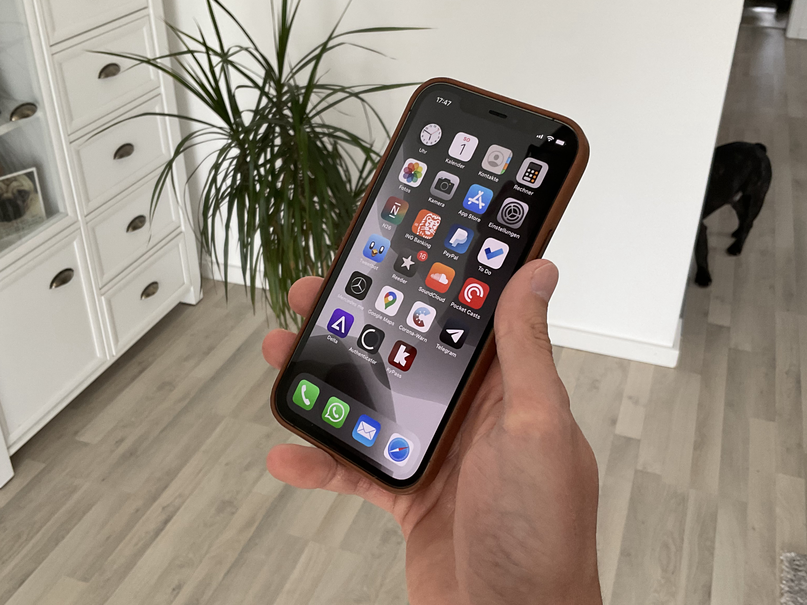

(Updated for 2024)

Made a [similar list for Android](https://robertkrau.se/blog/android-essentials/) a few years back and while I don't plan to leave iOS I still like to share my favorite apps. When I don't specificaly name e.g. a Mail App this means I use the included App from Apple.

[Superlist](https://apps.apple.com/us/app/superlist/id1547585270)\
Superlist is the closest to Wunderlist, that I miss so much.

[Soundcloud](https://apps.apple.com/us/app/soundcloud-musik-songs/id336353151)\
I almost exclusively list to DJ Sets so this is the right fit for me. I only wish they would provide CarPlay integration...

[Pocket Casts](https://apps.apple.com/de/app/pocket-casts-podcast-player/id414834813)\
Best Podcast Player

[Reeder](https://apps.apple.com/us/app/reeder-5/id1529445840)\
Clean RSS Reader that syncs across iOS Devices and does the job, so I'm willing to spend a few Euros every year or so for the newest version.

[X](https://apps.apple.com/us/app/x/id333903271)\
I just stay in the chronologic feed and actually like the idea of censorship free everything app for the western world.

[Authenticator](https://apps.apple.com/us/app/authenticator/id766157276)\
At just under 10 Mbyte it provides exactly what I need and no bloat. 2FA Authenticator might have the lead when it comes to design though.

[Altstore](https://altstore.io/)\
Finally third party stores are a reality (in Europe). The Delta App from the same developer is waiting to start Pokemon when I'm really bored.

[OneDrive](https://apps.apple.com/us/app/microsoft-onedrive/id477537958)\
I hate subscribtions but using Microsoft 365 and having access to the most current Office apps on my computer plus the cloudstorage for me and my girlfriend for just 50€ or so per year is a nobrainer

[KeePassium ](https://apps.apple.com/us/app/keepassium-keepass-passwords/id1435127111)\
Replaces KyPass for me since it is better looking

[Simplenote](https://apps.apple.com/us/app/simplenote/id289429962)\
A client that can be used on every platform, looks great and does the jobs since many years? Simplenote is here to stay.

[Mercury Weather](https://apps.apple.com/us/app/mercury-weather/id1621800675)\
While the main USP of the wheater app is the cocky "AI", I just like the widgets and the occasional in depth wheater forecast. Can also be used with Shortcuts.

[Opener](https://apps.apple.com/us/app/opener-open-links-in-apps/id989565871)\
Unbelivable that this is not part of iOS after 14 years, an absolute must.

[1Blocker](https://apps.apple.com/us/app/1blocker-ad-blocker/id1365531024)\
When it comes to Adblocking, iOS is ahead of Android in my opinion. 1Blocker ist the best one available I think