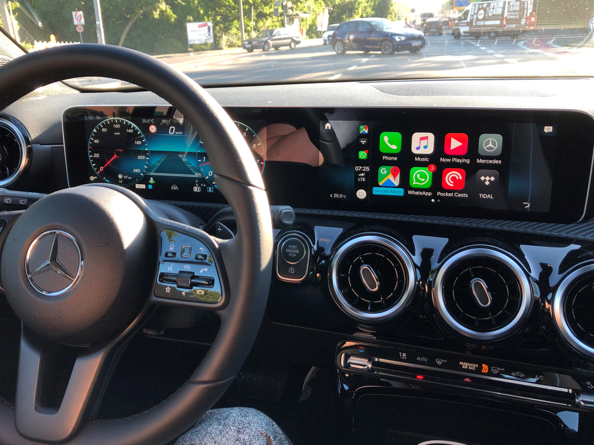
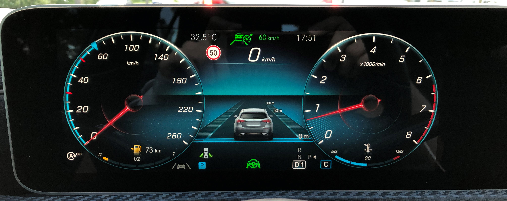

Das beste Infotainmentsystem mit Carplay/Android Auto genauer angeschaut

---

## Hardware

An der Hardware gibt es fast nichts zu meckern – Mercedes arbeitet mit einem starken Partner zusammen. [Nvidia](https://blogs.nvidia.com/blog/2018/01/09/mercedes-ces-2018/) liefert eine großartige Hardware-Basis, die von zwei fantastischen Bildschirmen komplimentiert wird (im Falle der 10"-Screens).

Die Panele sind mit Full-HD absolut ausreichend hochauflösend und die hohen Helligkeitswerte erfordern kein Sonnenschild. Die Bildwiederholrate ist meistens im 60fps-Bereich, nur die integrierte Navigationssoftware scheint nicht auf das Hardwarepotential optimiert zu sein und ruckelt. Der kapazitive Touch-Digitizer arbeitet vermutlich mit 30 Herz, dadurch wirken Swipe-Gesten direkt am Screen etwas stotternd. Über das Touchpad in der Mittelkonsole oder die Touchflächen am Lenkrad tritt der Effekt nicht auf. Die serienmäßig verbauten 7 Zoll Bildschirme wirken ganz besonders aufgrund der Einlassung sehr unzeitgemäß. Käufer sollten lieber auf jede andere Zusatzaussattung verzichten als auf das Display- oder Navigationspaket.

Zukünftig fände ich den Einsatz von OLED-Panelen spannend, dann würde der Übergang von Display zu Bezel noch wenig auffallen. Über Sensorik können die Blickrichtung des Fahrers/Beifahrers erfasst und durch Bildbewegung ein Einbrennen verhindert werden.

## Design

Gemischte Gefühle beim User-Interface-Design aufgrund gemischter Designprinzipen. Vereinzelt auftretendes Flatdesign trifft auf unzeitgemäßen Skeuomorphismus im Glas-Look. Hier muss es meiner Meinung nach unbedingtes Bestreben sein, diese gestalterischen Entscheidungen zu verwerfen und ein zeitgemäßes minimalistisches Flat-Design zu entwickeln.

Außerdem: Warum ist beispielsweise die Darstellung eines vorausfahrenden Fahrzeuges noch immer so statisch dargestellt? Der Ursprung durch Segmentanzeigen ist klar, diese technische Limitation gibt es jedoch nicht mehr und man könnte eine präzisere Anzeige ermöglichen.

Carplay und die künftige Version von Android Auto hat über die volle Bildschirmbreite zu funktionieren. Für mich kann der Grund für diese Einschränkung nur deplatziertes Branding oder eine zu wenig in Frage gestellte Management-Entscheidung sein.

[https://twitter.com/feinripp/status/1134416006451998720](https://twitter.com/feinripp/status/1134416006451998720)

Ein zusätzliches optionales Theme würde helfen, Feedback in diese Richtungen zu sammeln und wenig technisch affine Autobesitzer nicht zu überfordern. Eine Ökosystem das Userfeedback zulässt, ist dafür essentiell.

## Ökosystem / Infrastructure

Wo bleiben die Updates? Warum findet dazu seitens Mercedes keinerlei Kommunikation statt? Warum gibt es keinen Info-Kanal? In Foren und Social-Media [findet Spekulation](https://www.motor-talk.de/forum/software-updates-und-version-mbux-t6368667.html) statt, die Korrekturbedarf hat. Warum ist mbux.com nicht registriert und stellt Inhalte bereit? Wo bleibt das auf der CES vorgestellte [auf MBUX angepasste Supertux](https://www.computerbase.de/2019-02/mercedes-benz-cla-mario-kart-mbux/)?

MBUX fühlt sich wie eine Plattform an, die noch wächst. Für mich war ein essentieller Entscheidungsgrund für das Fahrzeug die Erwartung von regelmäßigen OTA-Updates und neuen Features. Jetzt wird es spannend, ob Daimler diesbezüglich abliefert. Sonst könnte die künftig marktbestimmende Generation Z – die Updates voraussetzt und durch alle anderen technischen Produkte gewohnt ist – abgeschreckt sein.

*(Sprachbedienung und die neue Gestensteuerung blieben im Artikel unerwähnt, da ich diese Features nicht nutze)*