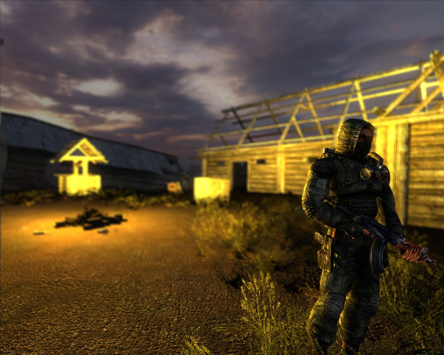
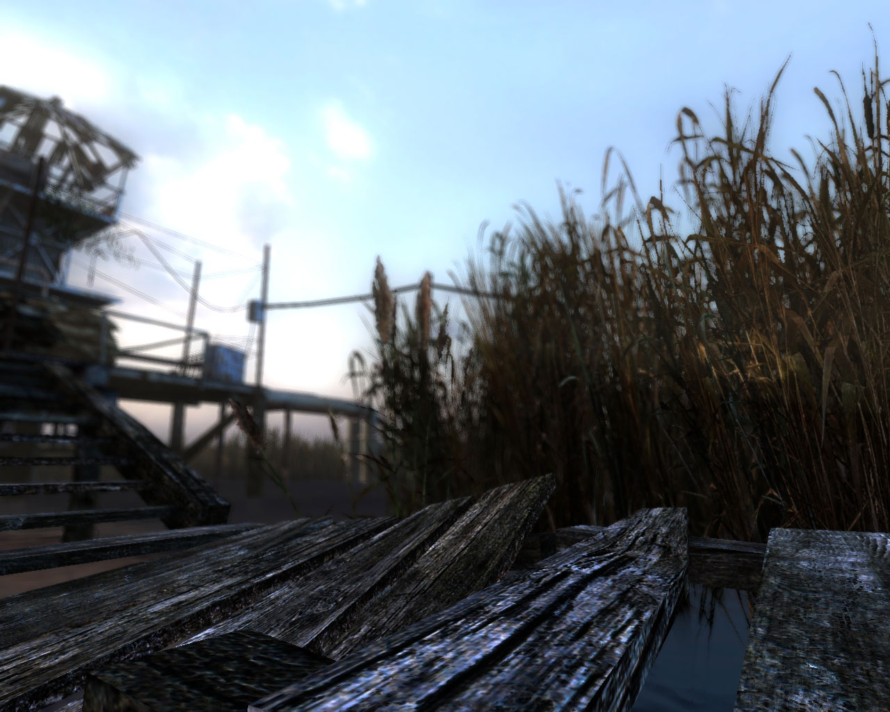
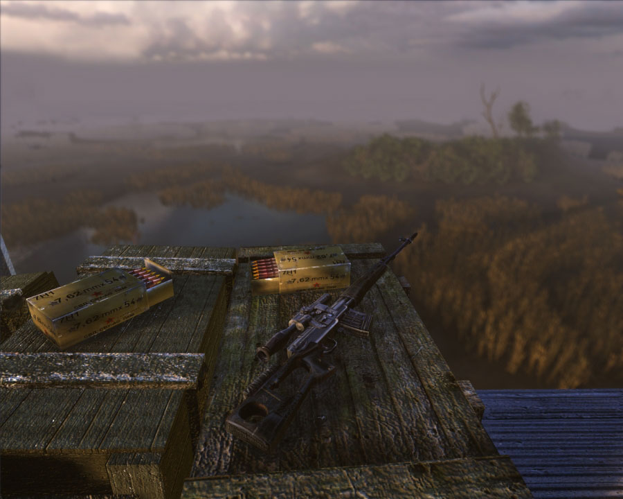
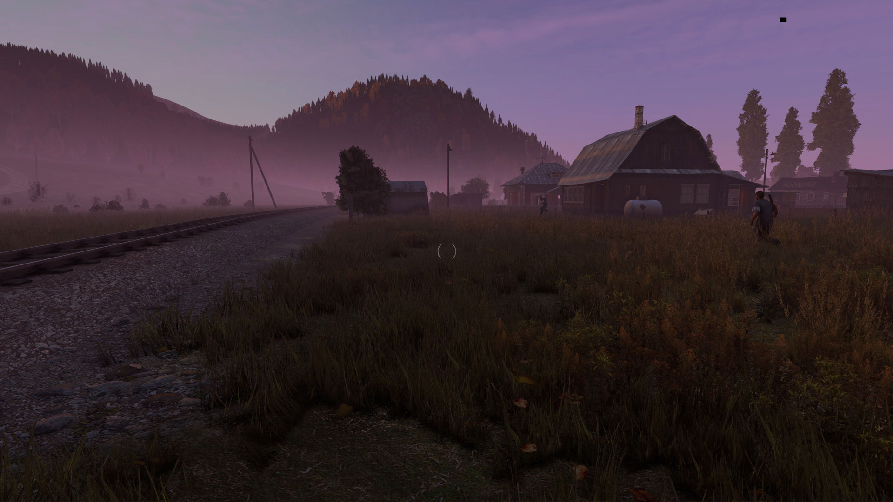
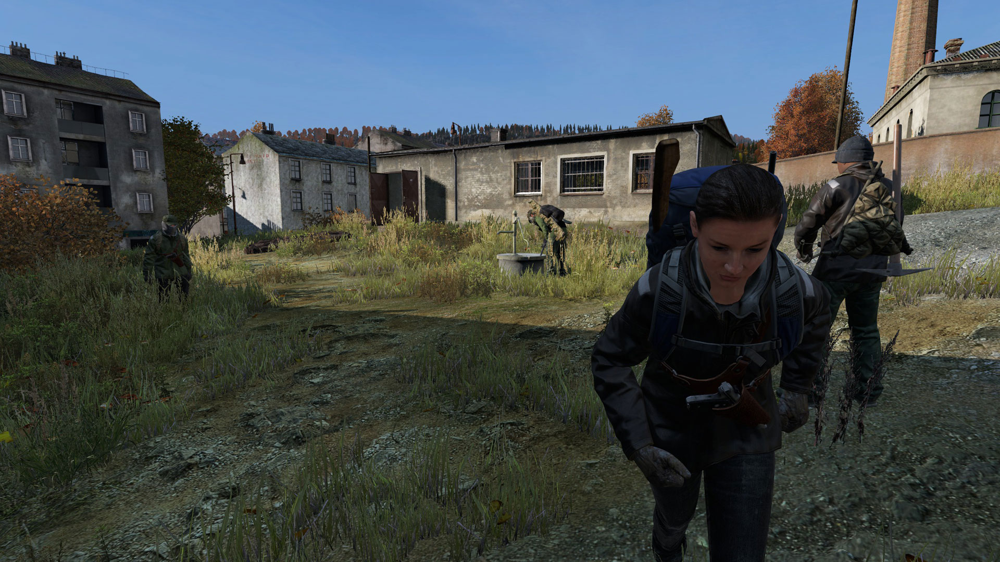
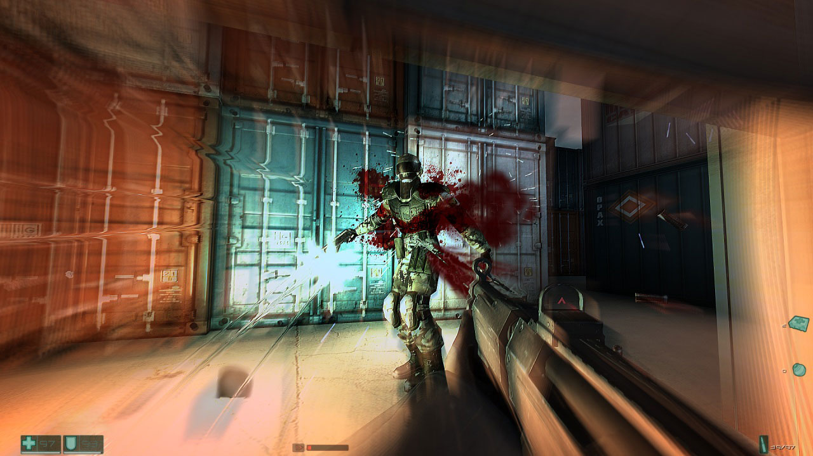
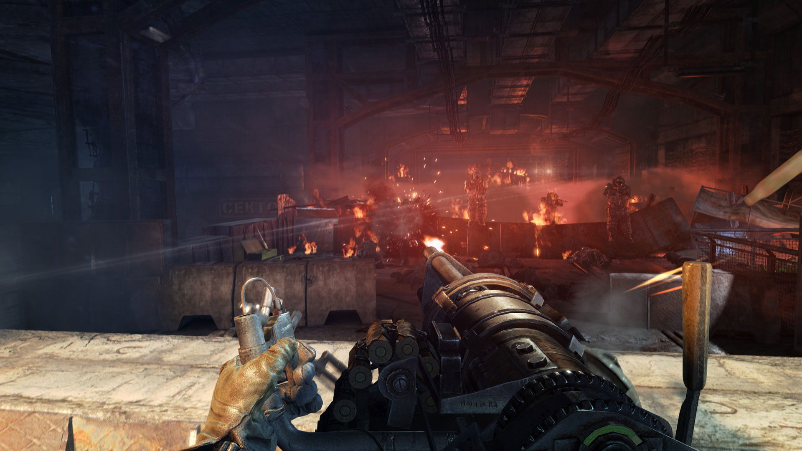

Installing Windows 10 in the most clean way possible without breaking stuff

---

## S.T.A.L.K.E.R. (Shadow of Chernobyl, Clear Sky, Call of Pripyat)

I had an obsession with this game, its development and the history around the reactor incident.

Sometime even kotaku has an [interesting read](http://kotaku.com/most-survival-games-have-problems-that-s-t-a-l-k-e-r-s-1683484728), about what made the series special.

I have to get an article regarding all the pre-alpha builds up. Those allow an interesting look at the early states of the game.

The way to play the S.T.A.L.K.E.R. experience these days is [Lost Alpha](http://www.moddb.com/mods/lost-alpha) or [Call of Chernobyl](http://www.moddb.com/mods/call-of-chernobyl). The modding scene is very alive, even the engine is getting reworked.

Next to playing the S.T.A.L.K.E.R. games you have to read [Roadside Picnic](https://en.wikipedia.org/wiki/Roadside_Picnic) and watch [Stalker](http://www.imdb.com/title/tt0079944).

## DayZ

A multiplayer experience unlike any other. You die – you lose everything. Every encounter with another player gets your heart pumping and adrenalin running. Death does not only come through man’s hand but also hunger, thirst, temperature and infected AI. It really is a hardcore survival simulator gaming experience. And it asks for your patience to get a fully developed game eventually – doubts guaranteed.

## Half-Life (1, 2, Episodes, Black Mesa)

Not many words are necessary – this is the most famous Ego-Shooter franchise. Everything is perfect to deliver a unique atmosphere, changing settings and mechanics. You have to play those games!

## F.E.A.R.

Back in the day F.E.A.R. brought me nightmares and fascination. The nightmares from its horror elements and the fascination because of the technics and brutality. Slowmotion and bullets transform the monotone looks into a blend of light, particles and blood. An outstanding AI challenges you to choose your weapons and time manipulation carefully. Get EAX running and play this game.

Slowmotion and bullets transform the monotone looks into a blend of light, particles and blood.

> Slowmotion and bullets transform the monotone looks into a blend of light, particles and blood.

Check out this video by [Turbo Button](https://www.youtube.com/user/KuribosMask/featured) to learn more about this shooter’s AI:

[F.E.A.R. – Level and Enemy Design – YouTube](https://www.youtube.com/watch?v=p_3LQhncl2c)

## Far Cry

As described in my [Far Cry article](https://robertkrau.se/blog/far-cry-a-pc-gaming-masterpiece/), I like this game because it mixes diverse gameplay elements so well. Read more about that and learn about coop.

## Metro 2033 and Metro Last Light

This ego-shooter series by Ukranian developer 4A games packs oppressive atmosphere and charming stealth mechanics into a one of a kind package with breathtaking graphics. Including the remake you can choose from four games

* Metro 2033
* Metro Last Light
* Metro 2033 Redux
* Metro Last Light Redux

There are some DLCs as well and it’s not obvious which one delivers the best hardcore gameplay experience. I have to test it out.

