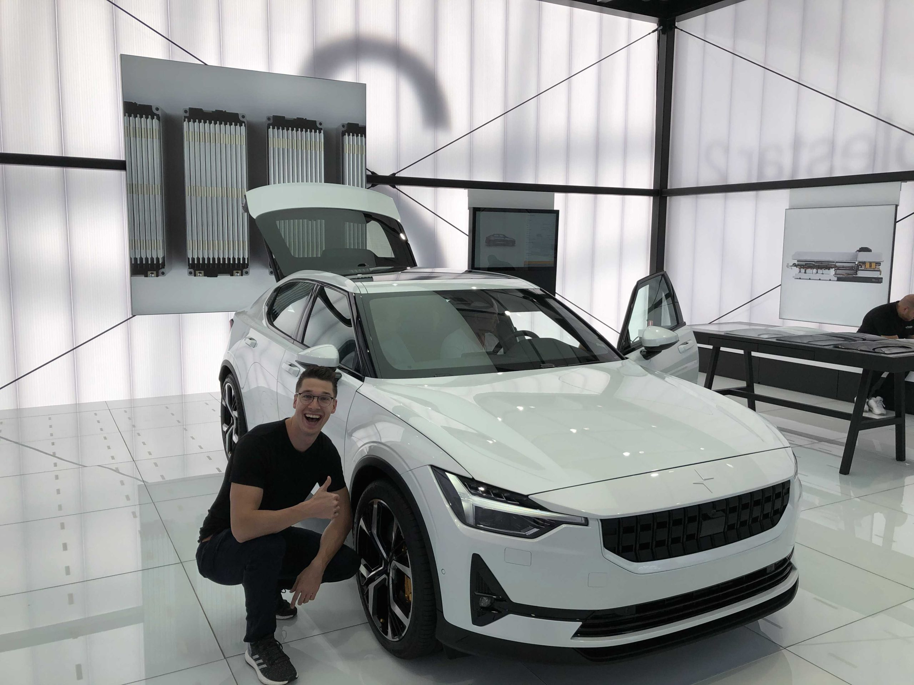
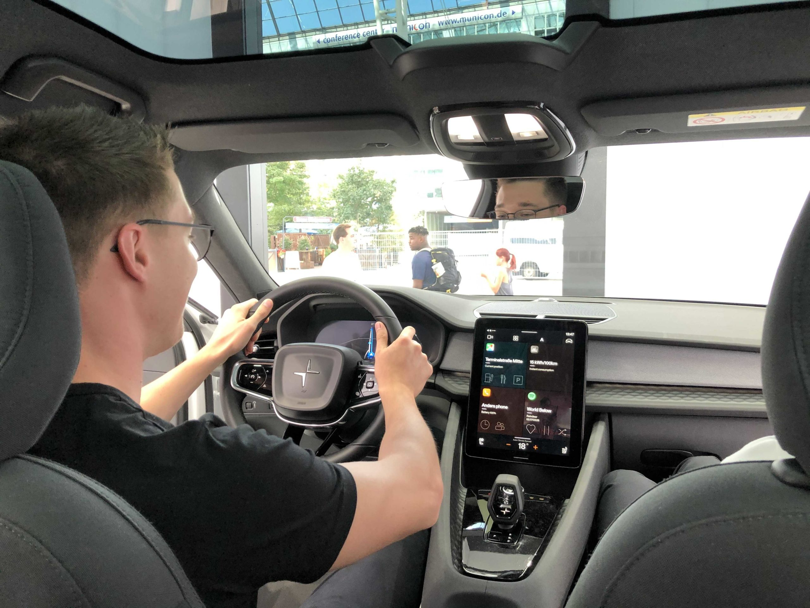
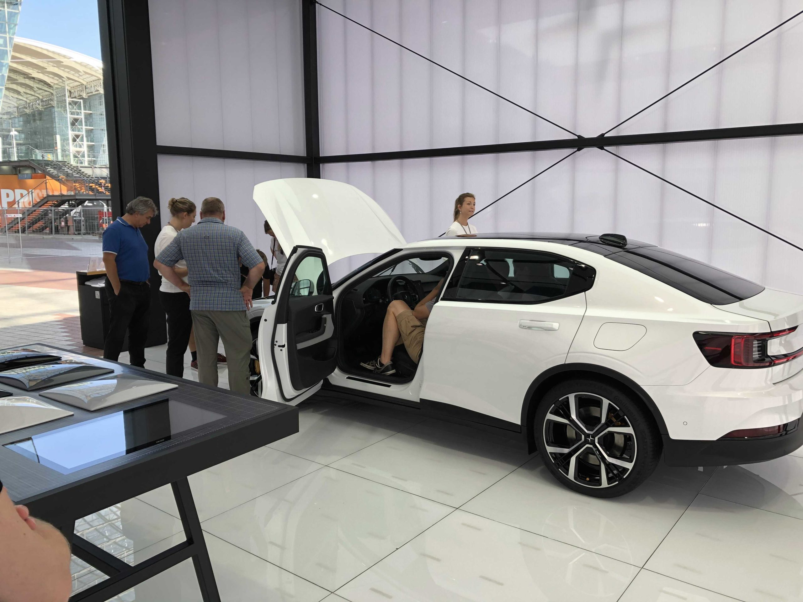

I went to a roadshow event at the Munich airport to take a closer look at the Polestar 2 and asked questions for details that do not show up on the official website

---

I’m not going to list technical specifications here, since you can find those on the nice website and configurator: [https://www.polestar.com/de/cars/polestar-2](https://www.polestar.com/de/cars/polestar-2). Instead I will focus on how the Polestar 2 will position itself in the EV landscape in my opinion.

## Design

It’s a great looking car. People at the roadshow noticed that first. I really like the design language. It’s futuristic but also grounded, there is potential for a timeless appearence here. It mostly reminds me of the most current Dodge Challenger, but this car is way more subtle and mature. There is a lot of space in the trunk and the “frunk”, which is currently unique for non-SUV EVs. It think the Polestar 2 will appeal a lot to conservative buyers because of the design, but for other reasons too, that I will go into.

## Infotainment

It’s the first car that will come with the new Android Automotive OS, that is much more capable than Android Auto. The version shown in the Polestar 2 is clearly a development state. I looks like Google mostly provides Google Play Services integration and a launcher boilerplate. So the appearence (and quality) will differ greatly between manufacturers. Polestars implementation so far looks solid, but I’m fine with that since improvements can be done OTA. These updates will enhance the infotainment but not bring new car functionalities.

You can install select apps from the Play Store which is the most important thing here and a feature that will make many other manufacturers switch to Android Automotive OS eventually.

There are two very unique features, that stood out to me:

* Google Maps navigation in the dashboard
* Ability to use phone and messages without your smartphone

## Assistance / Autonomy

There is no information available when it comes to assistance / autonomy, so this was basically the first question I asked. The Polestar 2 will come with adaptive cruise control and maybe active lane assist, but other then that, it seems there is no autonomy higher than Level 2 planned for this car. I found cameras underneath the side mirros but there isn’t even an 3D-camera setup in the rear-mirror socket. I think Polestar will not follow Tesla’s example and trust in an stereoscopic image and radar setup to offer higher autonomuos driving in the future.

## Price

The first version of the Polestar 2 that will be come available next year will cost € 60k. I think that price is okay for the range, but this car will become way more interesting in 2021 when the price will drop down to € 40-45k – with a reduction of battery capacity and range of course.

## Conclusion

The Polestar 2 will be an exceptional entrance into the EV market after the rather exclusive Polestar 1. As I already mentioned it’s looks will convince buyers that don’t want to deviate to much from the industrial design of ICEs. Processing quality and materials will be great too.

But this car will not compete with what Tesla offers. The Tesla Model 3 has so many potential upgrades up it’s sleeve, there is probably no competition for quite some years to come.