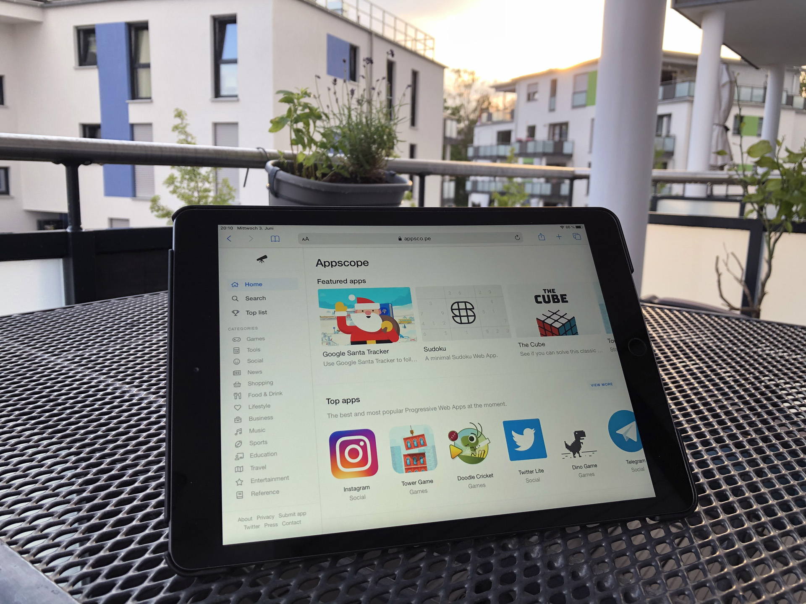

It's fascinating what can be done with web technology these days. But not anything

---

[https://twitter.com/frontenddude/status/1267136234775773184](https://twitter.com/frontenddude/status/1267136234775773184)

## The Rise of JavaScript

I believe that one of the most important criteria when it comes to chosing a programming language is the ease of use. JavaScript historically was not intended for complex implementations. In my opinion that is the reason why the barrier of entry is still so low and one can define her/his learning curve themself.

But JavaScript didn’t stay that way. It grew a community than constantly pushes the language and now even is used as an abstraction layers to create [native Windows and macOS Apps]()

A few years back I held a talk for a non-IT audience comparing web technology to native app development. I still stand behind my bold statement from back then:

> Websites start to feel broken. They have to behave like apps to stay relevant and competitiv.
>
> Robert Krause

There I showed that native app development is not needed in many cases to archive that “native feeling” since there are now Progressive Web Apps that only get more powerfull with time. And yes, taking a look at the features, it looks like anything can be done: [whatpwacando.today](https://whatpwacando.today/) similar to [whatwebcando.today](https://whatwebcando.today/)

There are even app-stores: [appsco.pe](https://appsco.pe/) or [progressiveapp.store](https://progressiveapp.store/)

## Why we are not here yet

Offline scenarios are handled quite well, but since the importance lessens with better mobile data coverage and open Wifis my focus is mostly on features that are present in native apps.

### No background refresh

The service worker is intended to do work when the main DOM thread is inactive. But it is too restricted compared to true native apps. There are attempt to add this missing feature with [.periodicSync](https://developer.mozilla.org/en-US/docs/Web/API/ServiceWorkerRegistration/periodicSync) but it will take a long while until this is available for all devices, if ever

### No notifcations triggererd from service worker

The Notifications API can be used to trigger notifications through the service worker while the app is active. But the more interesting way of displaying notifications when the browser is inactive by using the Push API depends on a server implementation. And while there are easy to use soluations available, sometimes you just want keep it simple without external dependencies and even in offline scenarios

### No notifcations on ios

Thats it. This is still not available. And this is not the only huge compromise that cripples PWAs on iOS.

### Comfort of installing an app

What do I mean by that? The success of the PWAs is hindered by the same reason the homescreen of a modern iPhone still looks very much like the first one. People get used to first impressions and then get comfortable with it. Change is very difficult to establish. And people are very much used to installing an App from the AppStore or Playstore. Notfications in the Browser feel like ads or malware even.

## Future Prospect

I honestly don’t know. Maybe adding features that I mentioned will help, maybe the install process hast to be simplified. I also like the idea of publishing PWAs to the offical App stores but dislike the required effort.

As always it’s important to stay up to date with technology and open minded. Only then you can stick with objective decisions.