Artikel rund um S.T.A.L.K.E.R. - Shadow of Chernobyl, vor zehn Jahren geschrieben aber nie veröffentlicht. Jetzt aber doch noch

---

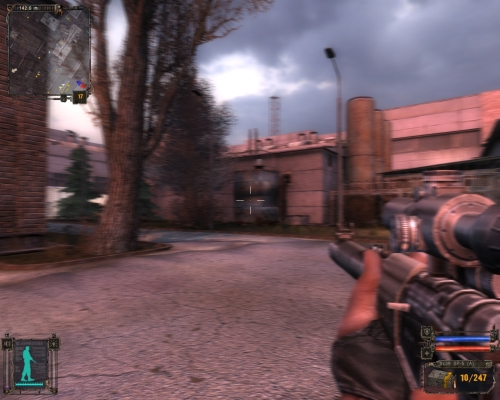

März 2007. Eine über die Jahre erhalten gebliebene Community zittert um das Spiel auf das es seit fünf Jahren wartet. Erscheint es diesemal wirklich? Ja, das tut es und die hohen Erwartungen der Fans werden erfüllt. Mit der Frage, wie es dem russischen Entwicklerteam GSC gelugenen ist, aus Stalker einen Konkurrenten zu Spiele-Blockbustern wie **Half-Life²**, **FarCry (dt.)** oder **Doom³** zu machen, soll sich dieser Artikel beschäftigen.

## Verwirrende Zusammenhänge
*Ein schrottreifer LKW braust bei Gewitter über eine verlassene Straße. Auf der Ladefläche häufen sich schrecklich entstellte Leichen. Plötzlich schießt ein Blitz mitten in den Wagen. Das brennende Gefährt überschlägt sich mehrfach und kommt schließlich abseits des Wegs zum Liegen. Später: Ein erfahrener Stalker, so nennt man die Artefaktjäger in der Zone, untersucht den Unfallort. Dabei fällt ihm ein Staker besonders auf. Dieser scheint im Gegensatz zu den Anderen zu leben. Der Finder verkauft den Totgeglaubten beim örtlichen Händler.*

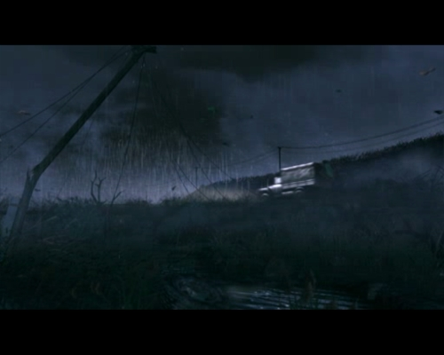

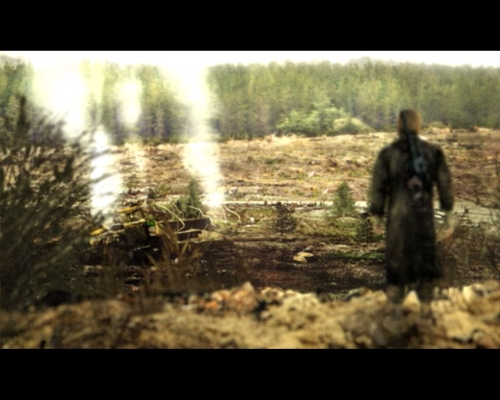

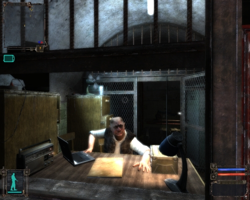

Hier beginnt die Geschichte von **S.T.A.L.K.E.R. – Shadow of Chernobyl**. Man schlüpft in die Rolle des gefundenen Stalkers, des **Gezeichneten**, und von nun an gilt es mit allen Mitteln den Auftrag: “KILL THE STRELOK” auszuführen. Schon früh wird klar, dass man sich nahe an den explodierten Atomreaktor in Tschernobyl begeben muss.
Der Weg dorthin führt durch zahlreiche Gebiete rund um das Lenin-Krafwerk, die unterschiedlicher nicht sein könnten, und auch nach Untertage muss man sich begeben.
Nach und nach entwirren sich immer mehr Zusammenhänge, doch erst am Schluss kommt man hinter das Geheimnis.

Das Spiel hält viele Hauptquests bereit, die zwingend erledigt werden müssen um das Rätsel zu lösen. Daneben gibt es unzählige Nebenquests, deren Erfüllung mehr oder weniger lohnend ist. In diesen Nebenaufgaben geht es um das Beschaffen von Gegenstände wie bestimmter Artefakte oder verlorener Waffen und das Eliminieren von Stalkern. Friedliche Stalker zu töten stellt einen auch vor eine gewisse moralische Entscheidung. Dadurch erhält man Geld mit dem man sich neue Waffen, Rüstungen oder Items kaufen kann, die die Hauptquest erleichtern.

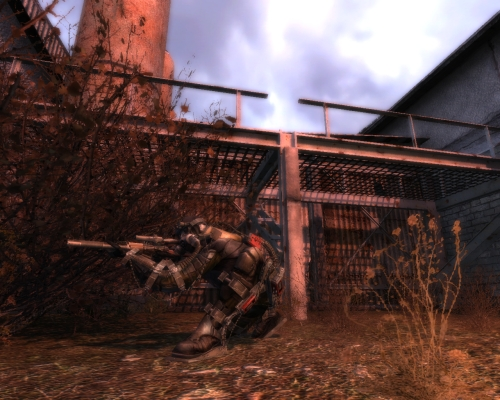

Des Weiteren gibt es die Möglichkeit sich für eine Fraktion zu entscheiden und sich dieser anzuschließen. Der Wiederspielenswert steigt, weil man dann nochmal an Seite der jeweils anderen Fraktion kämpfen möchte.

Das Spiel hält sieben mögliche Enden bereit, darunter vier sehr unbefriedigende; die anderen beiden sind aufschlussreicher.

## Alte, neue Grafik
*Gerade die Grafik war immer in Faktor, der S.T.A.L.K.E.R. am Leben gehalten hat. Die sogennante __X-Ray-Engine__, die im Laufe der Jahre immer weiterentwickelt wurde, sorgt für eine glaubhafte Darstellung der Spielwelt und trägt sehr zur Atmosphäre des Endzeit-Szenarios bei.*

Da das Grafikgerüst bekanntermaßen schon etwas älter ist, hat es leider auch einige Schwächen. Die Texturen, die nur mit einer Auflösung von 512 x 512 bereitstehen, gehören dazu.
Was auch sehr stört, ist das übertrieben eingesetzte **Parallex-Mapping**, das performanceschonend für plastischeres Aussehen sorgen soll. Leider tritt dadurch ein Effekt zu Tage, der viele Oberflächen so aussehen lässt, als wären sie mit einer Flüssigkeit überzogen, oder beständen aus Kunststoff.

Natürlich ist die Grafik denoch genial, dem hochmodernen **DX9-Renderer sei Dank**. Dieser verfügt über die Technik Deffered-Shading. Sie sorgt für eine höchst glaubwürdige Ausleuchtung der Spielwelt und Verwaltung großer Licht- und Schattenmengen bei vergleichsweise geringem Performanceverlust.
Aber auch der **DX8-Renderer** braucht sich nicht zu verstecken, da er sehr ausgereift ist und auch schächeren Maschienen eine faszinierend schöne Welt auf den Bildschirm zaubert.

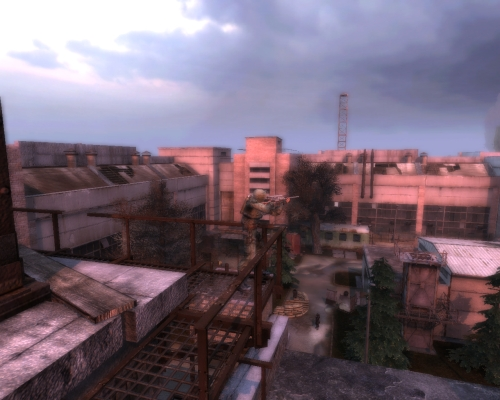

## Horchet auf!
*Der Sound in Stalker hinterlässt einen gespaltenen Eindruck.*

Einerseits ist die Musikuntermalung sehr gut gelungen. Sie passt immer sehr gut zu Umgebung, in der man sich gerade befindet, und unterstreicht die dort herrschende Atmosphäre noch weiter. Gerade in den Untergrund-Levels sorgen unheimliche Geräusche für Gänsehautgarantie.

Dem gegenüber stehen allerdings die teils völlig unpassenden Waffensounds. Diese klingen trotz maximal aufgedrehtem Basses oft blächern und kraftlos.
Zudem ist die Ortung mancher Gegener völlig unmöglich. Der Sound lässt eine unmittelbare Anwesenheit des Gegeners vermuten, obwohl sich dieser weit entfernt befindet. Vor allem die die Tiere sind hiervon betroffen.

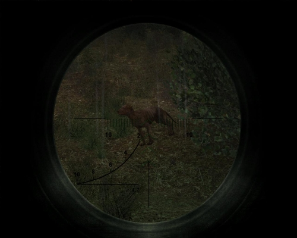

Man kann im Menü die Option **EAX** aktivieren; wenn es die Soundkarte ermöglicht, sollte man das auch tun. Allerdings sollte man den neuesten Patch aufgespielt haben, damit EAX problemlos funktioniert.
Wer die Möglichkeit und die entsprechenden Sprachkenntnisse hat sollte Stalker auch mal auf Englisch spielen, die Dialoge sind dann nach Meinung mancher Stalker-Fans um einiges besser vertont.
Leider sind die meisten Dialoge, auch die, die für die Story  relevant sind, nicht vertont, man muss sich also darauf einstellen, viel zu lesen. Der offizielle Soundtrack steht zum kostenlosen, legalen Download auf der offiziellen S.T.A.L.K.E.R.-Homepage bereit.

## This is Feeling!
*S.T.A.L.K.E.R. beeindurckt neben seiner Grafik und der spannenden Story auch durch seine sehr dichte und packende Atmosphäre.*

Die Entwickler haben sich in den gefährlichen 30-km-Radius rund um das **AKW** begeben, um die **Zone** originalgetreu nachzubauen. Dies ist sehr gut gelungen, doch leider werden die sonst weitläufigen Areale durch hässliche Drahtzäune begrenzt und es muss, entgegen urspünglicher Planungen, zwischen den einzelnen Leveln langwierig geladen werden, was die Atmosphäre etwas trübt.

Das Spiel wartet mit dynamischem Wetterwechsel und Tag/Nacht-Wechsel auf.

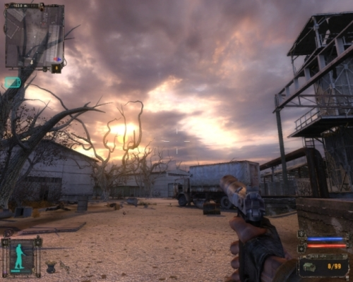

Natürlich ist der Gezeichnete nicht allein in der beängstigenden Umgebung, sondern muss sich mit allerlei Gegnern herumschlagen.
Aufgrund der gewinnbringenden Artefakte hat es Forscher, Kopfgeldjäger, Banditen und damit verbundenes Militär nach Tschernobly gezogen. Das Faszinierende ist, dass diese durch eine **A-Life** genannte Simulation geleitet werden. Sie agieren völlig selbständig und ihr Handeln richtet sich nach ihrer Chance auf Überleben.

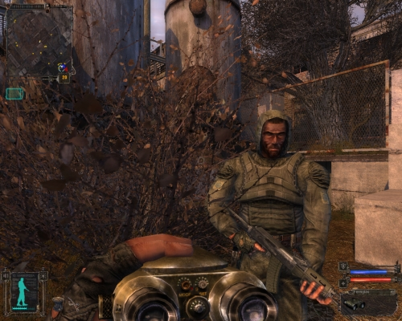

In der Spielwelt haben sich aufgrund der radioaktiven Strahlung zahlreiche Mutanten gebildet, denen sich der Gezeichnete neben den menschlichen Gegnern stellen muss. Auch diese sind per **A-Life** gesteuert, wodurch sich manchmal lustige Situationen ergeben können.
So jagen einige Hunde ein Wildschwein – dieses stößt während der Jagd auf einen Artgenossen und so werden die Jäger zu den Gejagten.
Solche Handlungen zu beobachten kann sehr spannend sein, und lässt einen noch weiter in die Welt von S.T.A.L.K.E.R. eintauchen.

Eine Trübung der Atmosphäre macht der hohe Schwierigkeitsgrad aus. Selbst auf der niedrigsten Stufe ist das Spiel für erfahrene Shooter-Veteranen ein kleine Herausforderung. Genre-Neulinge werden ihre Probleme haben.

Das Spiel stellt zahlreiche Waffen bereit, die perfekt in das Szenario passen. Es gibt Pistolen, Schrotgewehre, Automatische Waffen, Scharfschützengewehre und schwere Waffen. Die Munition ist teilweise sehr rar – was sehr realistisch ist. Manche Waffen sind nur einmal im Spiel zu finden – aufmerksames “stalken” lohnt also. Außerdem lassen sich die Waffen mit Schalldämpfer, Zielfernrohr und Granatwerfer aufbessern.

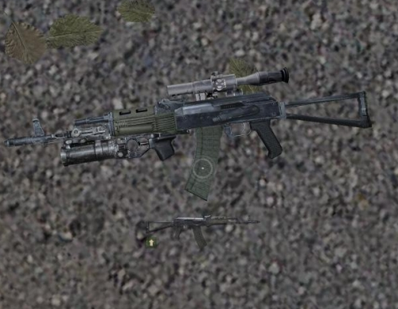

Um in der Zone überleben zu können brauchen die Stalker Anzüge. Diese schützen sie vor Beschuss, Strahlung und Anomalien. Anzüge sind nicht Toten abzunehmen sie müssen teuer gekauft oder gefunden werden.

Der Gezeichnete trägt einen PDA mit sich, der ihm laufende Aufträge listet, eine Karte der Zone hat und eine Rangliste aller Stalker führt. Dazu listet es wichtige Gespräche und Erkenntnisse des Stalkers.

Außerdem ist man mit einem Geigerzähler bzw. Dosimeter ausgerüstet, was eine vor radioaktiver Strahlung und Anomlien wart.

---

| | | |
| --- | --- | ---: |
| **Story** | + mysteriöse Handlung; + verschiedenen Enden; – teils unbefriedigende Enden | 7/10 |
| **Grafik** | + tolle Weitsicht; + viele Details; + modernste Technik; – überzogenes Parallex-mapping | 9/10 |
| **Sound** | + passende Musikunterstützung; – teils schlechte Waffensounds; – Ortungsprobleme | 7/10 |
| **Atmosphäre** | + passendes Endzeitszenario; + unterschiedliche Areale; – viele Gegner, die in Unmengen nachspawnen | 9/10 |

Gesamtwertung Singleplayer: **8/10**
*(Mulitplayer floß nicht in die Bewertung mit ein!)*

### Fazit:
S.T.A.L.K.E.R. ist nicht perfekt – viele Features wurden gestrichen – denoch ist es ein sehr gutes Spiel, das schon vor der Veröffentlichung ein Legende war und mit dem Erscheinen hat sich dieser Status gefestigt.

---

## Die Zukunft von Stalker:

Momentan *(09/2007)* ist die Version **1.0004** die aktuelleste; leider sind damit nicht alle Bugs entfernt, vor allem der Mehrspieler-Modus scheint noch zu kränkeln.
Einge Verbesserungen sind dennoch zu beobachten:

* Dual-Core-Optimierung
* Engine-Optimierung => 10-15% höhere Bildrate
* Shader-Optimierung

Was einem sofort positiv auffällt, ist die Tatsache, dass inzwischen Rattenrudel durch die Zone streifen – im Wildgebiet sollte man vorsichtig sein und eine zuverlässige Schrottflinte bei sich tragen.

### 1. Freeplay

Mit dem Patch 1.1 soll der Freeplay-Modus eingeführt werden; dieser soll nach dem erfolgreichen Durchspielen der 2 Hauptenden zur Verfügung stehen.
Darin übernimmt man die Rolle eines neuen Stalker, nicht aber des “Gezeichneten”.
Wichtigste Neuerungen sind darin sind:

* Steuerung der Monster, Stalker komplett durch A-Life; keine Scripts mehr
* keine Story-Missionen
* neue Quests
* neuartiges Wertungssystem
* neue Gegenstände und Waffen, die freigepielt werden können, wenn man gute Wertungen bekommt
* “Top 100” Wertung wird neu berechnet. Alle Stalker steigen/sinken während des Spieles im Rang auf/ab
* PDA erweitert

Eventuell erscheint der Freeplay Modus als Mod um dessen Entwicklung mithilfe der Community voranzutreiben.

### 2. S.T.A.L.K.E.R. – Clear Sky

*Kein Addon sondern ein allein laufendes Prequel*

Das Ganze basiert wieder auf der bewährten **X-Ray-Engine** die auch in **Shadow of Chernobyl** zum Einsatz kam.
Aufgebessert wird die Grafik allerdings durch eine komplett erneuerte Spiel-Physik. Außerdem soll der Renderer mit **DirectX 10** ergänzt werden, was auch endlich richtige Kantenglättung möglich machen würde.

Die angekündigten Features:

* Neue Gebiete
* Erweitertes A-Life-System
* NPCs nutzen Granaten
* Schnellreise-Funktion
* Erweiterter Einsatz von Detektoren, Artefakten und Anomalien
* Neues Upgrade-System für Waffen und Rüstungen
* Möglichkeit der Reparatur von Waffen und Rüstungen
* Überarbeitetes HUD und PDA
* Neueste Version der Engine – X-Ray 1.5
* DirectX 10 Renderer
* Verbesserter DirectX 9 Renderer – parallax bump, soft particles, depth of field, motion blur, eye adaptation effect.
* Neue Animations-Engine

**Zur Story:**
Die Ereignisse spielen ein Jahr vor dem 1. Teil. Die Zone wird viel aktiver sein als zuvor. Bandenkriege um Areale stehen an der Tagesordnung. Neben den bekannten Fraktionen gibt es auch die Gruppierung **“Clear Sky”**

GSC betreibt intensive Level-Wiederverwendung: Große Teil rund um Tschernobyl übernimmt der Entwickler in veränderter Version aus dem Hauptteil. Dennoch sollen ca. 50% neues Terrain für den Spieler zur Verfügung stehen.
Es sollen viel häufiger Anomalien vorkommen. Darunter auch neue **Raumblasen**. Man darf sich überraschen lassen.

**S.T.A.L.K.E.R. – Clear Sky** soll im 1. Halbjahr 2008 erscheinen. Erste Screenshots versprechen Großartiges, was die Atmosphäre in den neuen Gebieten betrifft.

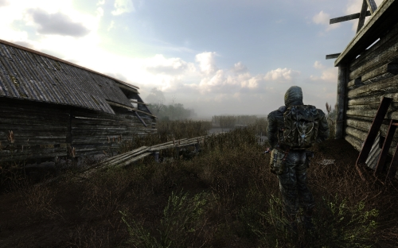

Auch existiert inzwischen ein Trailer, der die Gameplay-Änderungen demonstriert und erste Einblicke in die neuen Areale gibt.

---

## Die einzelnen Grafikoptionen im Überblick mit Erklärung:

Grafik-Fetischisten sollten sich klarmachen, dass für absolut flüssiges Spielen ein Core2Duo-Prozessor, 2 Gigabyte Arbeitsspeicher, und eine Nvidia Geforce 8800 oder AMD Radeon HD 2900 XT nötig sind. Da häufig von der Festplatte nachgeladen wird, sollte diese auch sehr schnell sein, oder sich in einem RAID-Verbund befinden.
Generell sind 1 Gigabyte Arbeitsspeicher ein absolutes Minimum, auch da sind noch sehr häufig Nachladeruckler zu erwarten.
Das Spiel läuft mit Windows Vista noch nicht problemlos, XP ist im Moment noch die bessere Wahl.
Auch scheint das Spiel eine Inkompatibilität mit der Geforce 8800-Serie aufzuweisen, die Dynamische Beleuchtung verursacht hier noch Bildfehler, die ein Spielen unmöglich machen. Hoffentlich schafft ein Treiber oder der nächste Patch Abhilfe.
Wer seiner S.T.A.L.K.E.R.-Installation etwas gutes Tun will verwendet die Float32-Mod – Bildqualität und Performance steigen.

### Haupteinstellungen:

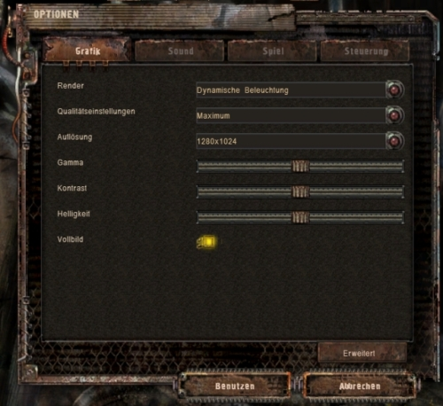

* **Render**: Möglichkeiten: **Statische Beleuchtung, Dynamische Beleuchtung der Objekte, Dynamische Beleuchtung**; Diese Einstellung entscheidet maßgeblich über die Performance. Bei einer DX8- oder schwachen DX9-Karte wählt man Statische Beleuchtung, bei einer mittelstarken DX9-Karte **Dynamische Beleuchtung der Objekte**, und bei einem High-Tech-Grafikbeschleuniger wie einer Nvidia GeForce 7900GT oder AMD Radeon X1950 Pro die Dynamische Beleuchtung
* **Qualitätseinstellungen**: Möglichkeiten: **Minimum, Niedrig, Mittel, Hoch, Maximum**; unrelevant, da wir die detailierten Grafikeinstellungen manuell festlegen
* **Auflösung**: Alle gängigen Auflösungen, auch Breitbild; Bei TFTs legt man ab besten die maximale Auflösung fest, damit das Bild nicht verschwommen ist. Nur bei starken Performanceproblemen reduzieren.

### Erweiterte Einstellungen:

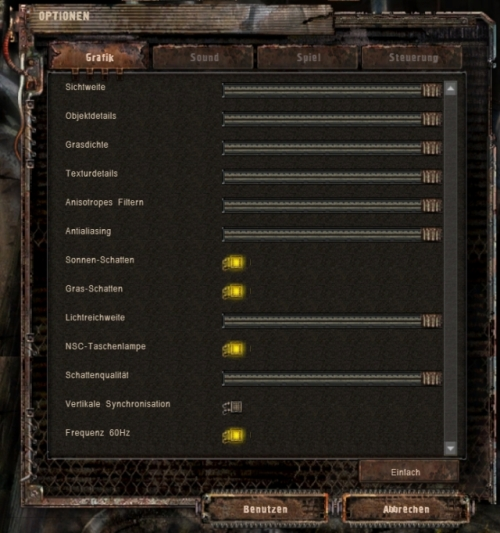

* **Sichweite**: Ab besten Maximal; mindert die Atmosphäre sonst sehr stark
* **Objektdetails**: Ab besten Maximal; mindert die Atmosphäre sonst sehr stark
* **Graßdichte**: Nach persönlicher Vorliebe; bei niedriger Einstellungen werden Waffe, Items, usw. leichter gefunden
* **Texturdetails**: Richtet sich stark nach dem Speicher der Grafikkarte; Grobe Richtlinien: 128 Mbyte: niedrige Einstellung, 256 Mbyte: mittlere Einstellung, 512 Mbyte und mehr: maximale Einstellung
* **Anisotropes Filtern**: Kostet wenig Performance, fällt bei hoher Graßdichte aber auch nicht so auf
* **Antialiasing**: Richtiges Antialiasing (Kantenglättung) nur bei Statischer Beleuchtung, bei Dynamischer Beleuchtung wirkt diese Einstellung als Blurfilter mit Edge-Detection
* **Sonnenschatten**: Optisch sehr ansprechend, zieht aber ordentlich Bildrate
* **Graßschatten**: Optisch sehr ansprechend, zieht aber ordentlich Bildrate
* **Lichtreichweite**: Sollte keinesfalls auf der niedrigsten Einstellung belassen werde, da sonst die Taschlampe des Gezeichneten kein Licht mehr spendet
* **NSC-Taschenlampe**: Legt fest, ob die anderen Stalker ihre Taschenlampe benutzten. Bringt keinen spielerischen Vorteil, wenn deaktiviert!
* **Schattenqualität**: Regelt die Auflöung der Schatten, Einstellung je nach Geschwindigkeit des PCs
* **Vertikale Synchronisation**: Sollte bei häufigem “Zerreisen” des Bildes bei heftigen Drehungen aktiviert werden
* **Frequenz 60Hz**: Legt die Bildwiderholungsrate auf 60 Herz fest.

Wer die Engine noch weiter ausreizen will, kann durch Tuning der **User.ltx**-Datei grafisch das Letzte herausholen. Man kann so weit gehen, dass das Spiel selbst auf modernsten Maschienen unzumutbar ruckelt. Diese Tuning-Möglichkeit ist aber für die Zukunft, in der noch schnellerer Grafikkarten unseren Alltag bestimmen werden, eine willkommene Option.

---

## Infos vor dem Kauf

Die deutsche Version ist ungeschnitten, **Ragdoll** (realistisches physikalisches Leichenverhalten) und Blut sind enthalten, bei der Installation kann man Englisch oder Deutsch als Sprache installieren.

Es gibt 2 Versionen des Spiels:

* **normale Version**

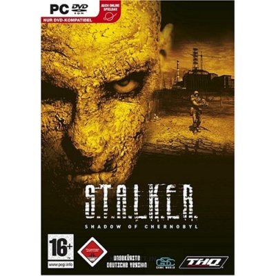

* **Radiation Pack**

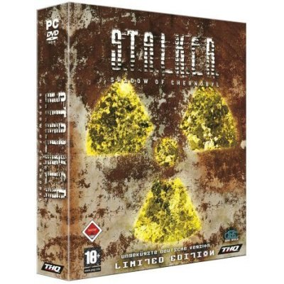

Inhalt **Radiation Pack**

* Survival-Guide mit detaillierten Informationen zu Waffen, Fraktionen, Mutanten usw.
* Bonus-DVD: Hinter den Kulissen, Musik, Artworks, Fansite-Kit und weiteres unveröffentlichtes Material
* Roman Todeszone: Die offizielle Vorgeschichte zum PC-Horror-Game als limitierte Sammler-Edition
* Detaillierte Gebietskarte der Zone
* Exklusive Software-Zugaben für den Mehrspieler-Modus
* Limitiert auf 17.777 Stück

### Die offiziellen Systemvoraussetzungen:

**Mindestvoraussetzungen:**
* **Intel Pentium 4 2 Gherz** oder **Athlon XP 2200+**
* **512 Mbyte RAM**
* **10 GByte** freier Festplattenspeicher
* **128 Mbyte DirectX 9c** kompatible Grafikkarte: **Geforce 5700 / ATI Radeon 9600**
* DirectX 9 kompatible Soundkarte
* Windows XP SP2 /  Windows 2000 SP4
* LAN / Internet-Verbindung mit DSL-Geschwindigkeit für Multiplayermodus

**Empfohlenes System:**
* **Intel Core 2 Duo E6400** oder **Athlon 64 X2 4200+**
* **1 Gbyte RAM** oder mehr
* **256 Mbyte DirectX 9c** kompatible Grafikkarte / **GeForce 7900** / **ATI Radeon X1850**

---

## Mehrspieler-Modus

Der Mehrspieler Modus von S.T.A.L.K.E.R. enthält die bekannten Modi **Deathmatch** und **Team-Deathmatch** sowie den Modus Jagd auf das Artefakt. Das Waffensystem funktioniert ähnlich dem von Counter-Strike. Vor jeder Runde bzw. wenn man gestorben ist, hat man die Möglichkeit Waffen zu kaufen.
Man benötigt eine sehr gute Internetanbindung um den Mulitplayer von S.T.A.L.K.E.R. geschmeidig zu spielen; **DSL-light** ist nicht ausreichend.
Inzwischen hat eine hat eine Stalker-Liga ihre Pforten geöffnete, in der man sich mit anderen Stalker-Fans messen kann.

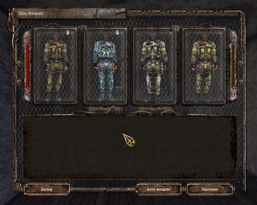

## Spoilergefahr!

Die nachfolgenden Informationen veraten Details zum Spielinhalt => nichts für Neulinge

### Das Inventar

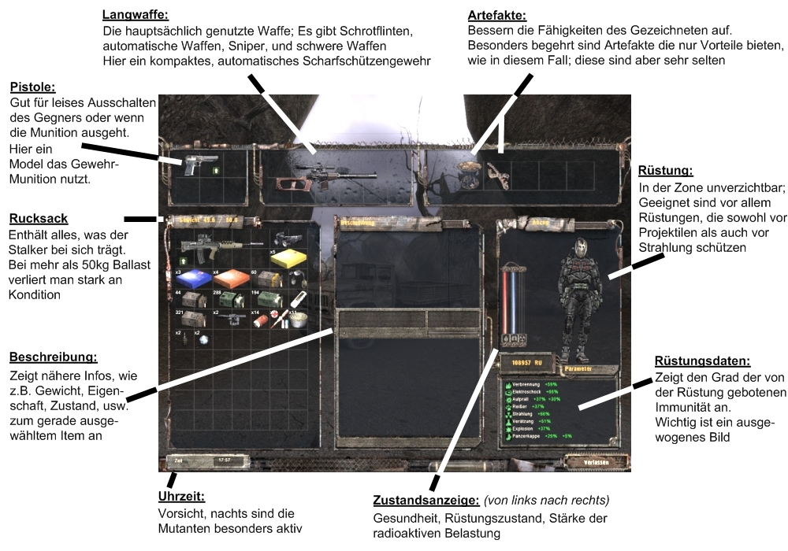

Was man immer dabei haben sollte:

* **Pistole**: möglichst schallgedämpft um von der Gruppe abgekommene Gegener lautlos auszuschalten
* **Gewehr**: nach eigener Vorliebe: Schrotfline, Maschinengewehr, Sniper; je nach Situation einsetzten
* **Munition**: für Gewehr und Pistole; vorsicht; richtiges Kaliber beachten; spezielle panzerbrechende Munition möglich
* **Granaten**: um verschanzte Gegner auszuschalten
* **Verbände**: der getroffenen Gezeichnete blutet – diese Wunden müssen verbunden werden
* **Medikits**: um Gesundheit widerherzustellen – normale, Armee-, Forschungs-Medikits möglich
* **Spritzen**: gegen die Verstrahlung; wenn keine Spritze zur Hand ist tuts auch Wodka – man schwankt durch die Zone
* **Artefakte**: können die Atribute des Anzuges verbessern – unbedingt negative Atribute beachten
* **Nahrung**: Salami, Dosenfleisch, was auch immer denn wenn der Magen knurrt, sinkt die Gesundheit
* **Anzug**: Das teure Vergnügen; es sei denn man schaut in alle Ecken; gewährleistet Schutz vor Beschuss, Strahlung und Anomalien

### Die Fraktionen

In der Zone treiben sich Anhänger verschiedenster Fraktionenen herum:

**Einzelgänger**:
Dem Gezeichneten gegenüber friedlich gestimmt, wenn man aber das Feuer auf sie eröffnet werden sie wütent und schießen zurück. Ihe Bewaffnung hängt von ihrem Rang und und dem Gebiet in dem sie sich aufhalten ab.

**Banditen**:
Von Anfang an ein lästiger Feind des Gezeichneten. Sie sind meist schlecht bewaffnet, greifen dafür in größeren Gruppen an. Wenn man längere Gefechte vermeiden will sollte man davonrennen. Die Ausbeute beim Plündern ist eher gering.

**Wächter**:
Neutral. Sie bewachen gewisse Bereiche der Zone und sind auf dem Kriegsfuß mit der Freiheitsfraktion. Man hat die Möglichkeit sich den Wächtern anzuschließen. Sie verwenden verschiedenste Waffen.

**Freiheit**:
Sie vertreten ihre eigene Ansicht um die Zone und kämpfen daher gegen die Wächter. Die Freiheit hat ein großes Militärlager und ist gut bewaffnet. Man kann sich dieser Fraktion anschließen.

**Soldaten**:
Werden in die Zone geschickt, um zu verhindern, dass die Stalker Überhand nehmen. Sie bewachen die Grenzen oder jagen in Gruppen herum. Sie sind von vornherein als Feind anzusehen. Ihre mittelmäßige Bewaffnung kompensieren sie mit Masse.

**Monolith**:
Sie sind ab dem Roten Wald anzutreffen und versuchen das Eindringen jedlicher Stalker zu verhindern. Sie sind gut bewaffnet und nur erfahrenden Stalker sollten sich in eine Kampf mit ihnen begeben.

**Söldner**:
Bezahlte Killer, die ihr Geld damit verdienen, in der Zone Killer-Aufträge auszuführen. Sie sind professionell bewaffnet und Feinde der Stalker.

**Zombiestalker**:
Diese armseligen Gestalten sind aufgrund der Strahlung verrückt geworden und schlurfen planlos durch die Gegend. Wenn man sie beschießt oder ihnen zu nahe kommt schießen sie ziemlich treffgenau, obwohl ihr geistiger Zustand miserabel ist.

**Forscher**:
Sie kommen in die Zone um wissenschaftliche Experimente mit den Artefakten durchzuführen. Im Kampf ziehen sie meist den Kürzeren, weil ihnen die nötige Erfahrung fehlt.

### Die Gebiete

S.T.A.L.K.E.R hält viele abwechsungsreiche Gebiete bereit, von denen jedes ganz spezielle Merkmale hat:

**Cordon**:
Das Startgebiet. Wenige Anomalien, kein starke Strahlung. Unter der Eisenbahnbrücke hält sich Militär auf, ein Bauernhof wird von Banditen besetzt. Hunde und Wildschweine streifen herum.

**Garbage**:
Der rießige Müllplatz birgt viele Artefakte aber auch Gefahren. Mit Pistole sollte man sich nicht mehr hierherwagen. In diesem Gebiet halten sich sehr viele Banditen auf.

**Agroprom**:
Ein großes Militärgelände. Hier halten sich sehr viele Soldaten auf. Diese Gebiet ist mit dem Müllplatz durch einen unterirdischen Tunnel verbunden.

**Bar**:
Hier ist der Treffpunkt der Stalker. Nach aufregenden Abenteuern können sie sich in der Bar entspannen. Der dortige Wirt ist zudem eine wichtige Schlüsselperson.
Das angrenzende Wildgebiet ist die Heimat vieler Mutanten wie Blutsauger oder Snorks. Auch streifen hier große Rudel von Ratten und Hunden herum.

**Dark Valley**:
Hier wimmelt es nur so von Banditen und anderem Gesindel. In den Untergrund geht es auch – Angstschweiß garantiert.

**Yantar**:
Eines der beklemmensten Gebiete in S.T.A.L.K.E.R.. Das verlassenen Fabrikgebäude stotzt nur so von Gefahren. In der Nähe des Sumpfes befindet sich ein mobiles Forschungslager in dem sich Forscher aufhalten, die die Hilfe des Gezeichneten benötigen.

**Army Warehouse**:
Hier entscheidet sich der Gezeichnete für die Fraktion Freiheit oder Wächter – man kann auch parteilos bleiben. Eine hügelige Landschaft, in der einige seltene Gegenstände gefunden werden wollen.

**Red Forest**:
Ab Beginn des Roten Waldes hat der Gezeichnete neue Feinde – die Monolith. Diese sind gut ausgerüstet und zahlreich. Außerdem macht einem die Strahlung zu schaffen. Auch eine Maschine will deaktiviert werden.

**Pripyat**:
Hier wohnten früher die Arbeiter des Atomkrafwerks. Heute ist es eine Geisterstadt. Man muss sich mit vielen Heckenschützen anlegen, die sich in den Blockbauten verschanzt haben.

**AKW Tschernobly**:
Nur erfahrene und gut ausgestattete Stalker sollten sich hierher wagen.