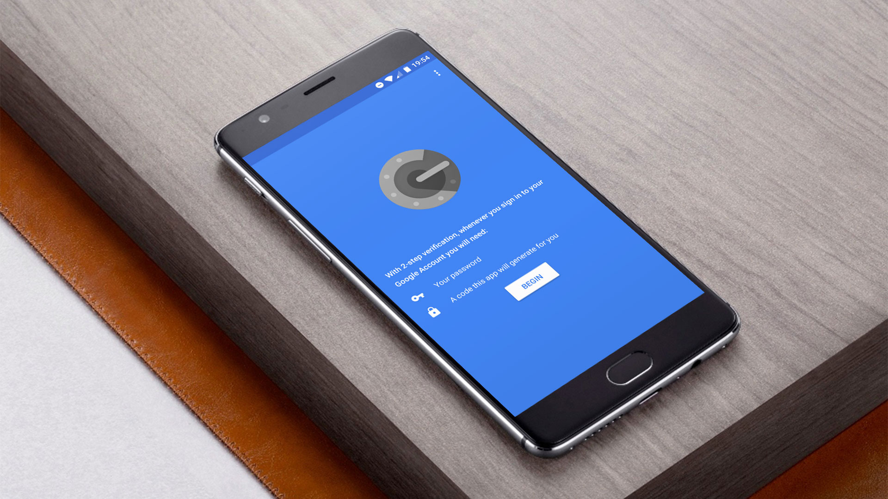

If you can memorize all passwords, they are probably unsafe

---

*Note: [Passwords don’t have to be unreadable to be safe](https://blog.codinghorror.com/password-rules-are-bullshit/). I adjusted the article accordingly.*

[One billion Yahoo accounts were hacked in August 2013](https://yahoo.tumblr.com/post/154479236569/important-security-information-for-yahoo-users). The attack became public in December 2016. Yahoo is not the only company with security problems. Adobe, Linkedin and Dropbox are in the huge list of companies or services that are aware and have publicly stated that their systems were compromised. [haveibeenpwned.com](https://haveibeenpwned.com/PwnedWebsites) is a neat webservice, that tracks hacked sites and lets you check if you were “pwned”.

Hopefully passwords are stored hashed and salted – but this is not always the case. If the attacker somehow is able to access the plain text password and you use that password somewhere else – or everywhere – you are fucked. Another example where the user becomes vulnerable is, when the password is

* too short
* ~a real word~
* ~does not consist of a wide character set~

Then a brute-force attack is more likely to be successful and access to your account and data can be gained.

## Get a Password Manager

That is why a password manager is a must-have these days. I use [KeePass](http://keepass.info/), which is open source. It is especially great because it has a lot of features like e.g. your database can be synced with dropbox, google drive, your own ftp and many more. You can also create a key file, so only devices that have this key can open your password database. There are tons of plugins available. On my Android phone I have [Keepass2Android](https://keepass2android.codeplex.com/), a free and absolutely great app to use KeePass on mobile devices with Android. [KeeWeb](https://keeweb.info/) has attracted my attention, so I will check it out in the near future.

There are other – more accessible – services like [1Password](https://1password.com/) and [LastPass](https://www.lastpass.com/) available. I have never used them and have no idea how safe they are.

Use a password manager and your online life is already infinitely times safer. But if somebody still gets access to your user credentials, e.g. by a keylogger, he can simply log in to your account.

## The rise of 2FA

Therefore we have Two-Factor-Authentication (2FA). It adds another layer of security by asking the user to verify with a token only he can access.

[twofactorauth.org](https://twofactorauth.org/) is a website that lets you check if and which type of 2FA a webservice offers. You can also tweet them to support 2FA (or tell them on facebook).

<https://twitter.com/feinripp/status/816407851916816384>

Until now I used 2FA over SMS. In order to declutter my messages and unify the #2FAexperience, I started using the [Google Authenticator App](https://support.google.com/accounts/answer/1066447). It manages all my tokens and doesn’t need a mobile connection.

[Authy](https://www.authy.com/) offers a mobile and desktop app that does the same but also stores your tokens in the clould – safely how they claim.