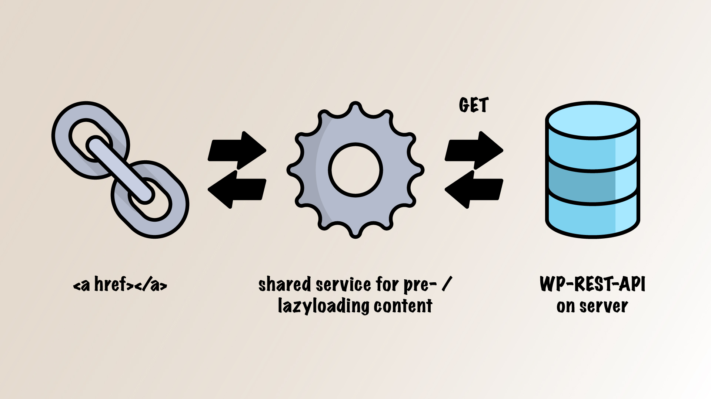
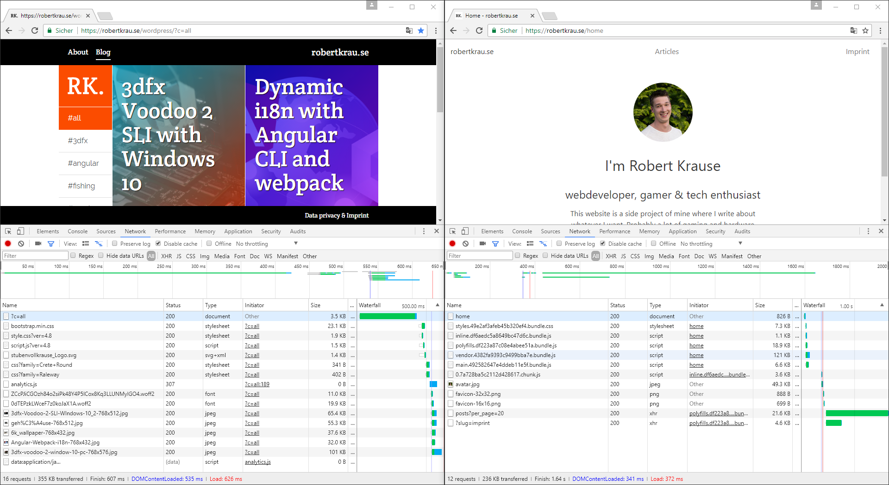

Relaunching my website as Angular SPA and declaring bold statements why websites must become webapps

---

*Note: I have reverted back to the old WordPress theme which I updated a litte. I was missing SEO too much and found the new design a litte bit too dull.*

I launched my first website last year using WordPress and a theme crafted together with [@stbnvll93](https://twitter.com/stbnvll93). Using [Bootstrap](https://v4-alpha.getbootstrap.com/) was a good choice to be able to quickly create a neat design inspired by the old design of [The Verge](https://www.theverge.com/). The category selection and all other functionality was done cleverly with [VanillaJS](http://vanilla-js.com/). You can check out [this article on the old page](https://robertkrau.se/wordpress/blog/websites-must-become-webapps/).

## Inherited burdens

But it also felt cluttered and technologically dated. There are certain things I dislike about conventional websites in 2017:

* the need for a database based CMS
* site reloads, despite little stuff changing
* requesting or possibly reloading stuff, thats already there (CSS, JS)
* in most cases an old protocoll (http/1.1)

The last two points are not strong arguments since clever caching strategies and using http/2 can reduce loading times. But I still think websites start to feel broken. Thats a crass statement – but think about it: We are at a historical point where there are now people that have experienced the web only through apps. Websites have to behave like apps to stay relevant and competitiv.

> Websites start to feel broken. They have to behave like apps to stay relevant and competitiv.

We can do that now because we have:

* fast devices
* high bandwidth
* mature JS frameworks

## Architecture

My website is now an [Angular 4](https://angular.io/) SPA that gets its content from WordPress through the great [WP-REST-API](http://v2.wp-api.org/). That way content can still be created and managed with that CMS. I didn’t have to write my articles again.

I switched from Bootstrap to [Bulma](http://bulma.io/) since I like the out-of-the-box look a lot more. I don’t want to spend much time styling.

The site is fast because of three things:

* no bloat
* preloading
* lazyloading

*(visualization by [@stbnvll93](https://twitter.com/stbnvll93), icons from [flaticon.com](http://www.flaticon.com/))*

Every hyperlinks in the content gets preloaded by the Service. Clicking those links will just change the view. Of course the Service also works if you enter the page through a specific url.

I’m in love with the WordPress plugin [Advanced Custom Fields](https://www.advancedcustomfields.com/). Using a few plugins it is possible to add its fields and the SEO settings to the REST-result:

* Advanced Custom Fields PRO
* ACF to REST API
* Yoast SEO
* Yoast SEO: ACF Analysis
* WP REST API Yoast SEO

## Numbers but Emotions

Angular 4 has become slimmer and by using AOT-compilation and lazy loading Modules with Components that i don’t need initially the bundle size is even smaller.

Loading times of the new page are similar to the old one – a few request less.
But after the inital loading all the other content is there instantly, except the pictures since I don’t want to stress the user’s bandwith too much. But we know the dimensions of those pictures – so nothing jumps around when viewing a post.

Requesting the content from the WP-REST-API still takes over one second. No wonder – it is requested from a MySQL-DB through PHP. Serving static files will improve those requests dramatically. There are plugins for that or I will build an own solution.

## Browser Support

What an important topic! But is it? Angular supports at least IE 9 and a lot of polyfills have to be activated. I do not have them on. Bulma is even worse. It uses flexbox which works with IE since Version 10 but is known to be buggy.

I do not care about users using these or even older browsers. Well i do care about them. Some of my content covers retro gaming topics and people reading those topics often use old computers, shitty smartphones and even shittier browsers. They are used to see the web broken.

I serve the content for them through other channels, in that case forums. Or they can use the old version of my site.

## SEO

One of biggest crititcs about SPA is that SEO is more difficult or even impossible. Since the Google Crawler is able to execute JavaScript I thought I should be fine if the meta tags are present.
I build a Service that automatically sets the meta tags by using the new experimental [Meta-Class](https://angular.io/docs/ts/latest/api/platform-browser/index/Meta-class.html). Great stuff. Also a sitemap.xml ist present.

But my site vanished from Google. The Google Crawler is not that advanced after all. The solution here should be [Angular Universal](https://universal.angular.io/). I will try that out and my site should be back in the search results and in social media previews.