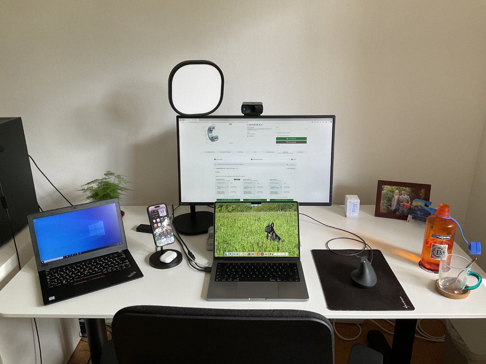
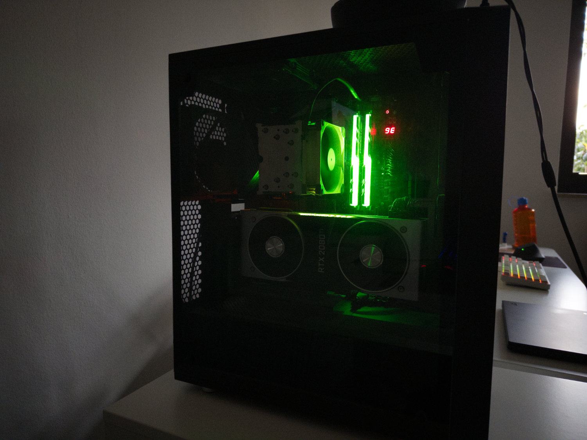
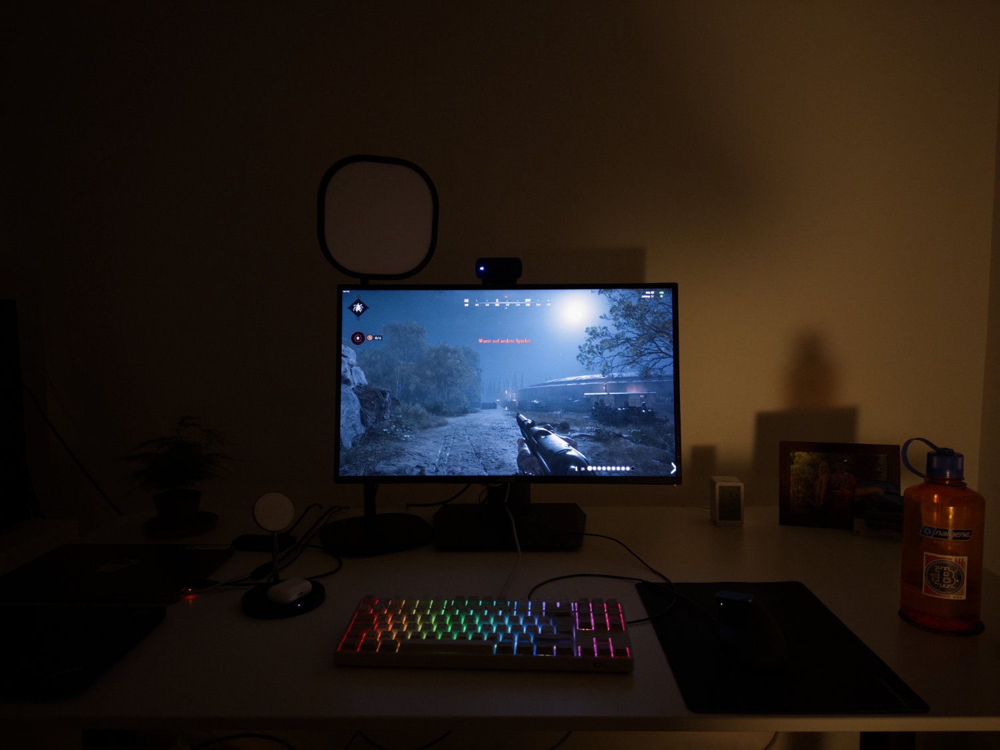

Refining the space where I spent most of my time

---

## Main System
* AMD Ryzen 5800X3D (curve optimized @ -30)
* Nvidia GeForce RTX 2080ti - mounted vertically with a bracket from CableMods
* G.Skill Trident Z RGB @ 3600MHz | 16-16-16-36
* Gigabyte z570 Aorus Master
* SSDs:
    * Samsung 970 EVO Plus 500GB (NVMe)
    * 2x Samsung 850 EVO 250GB (SATA)
* Fractal Design Meshify C LTG
* Asus ROG PG279Q
* Windows 10

Listing all these specs reminds me of nethands.de, which was a website to do excatly that

## Work System
* Apple MacBook Pro M1 14"

## Emergency System
* Lenovo ThinkPad X280 - running Windows 10 LTSC IoT as described [here](https://robertkrau.se/blog/clean-windows-10-install/)

## Other
* IKEA BEKANT adjustable height table
* Steecase Gesture chair
* Logitech MX Vertical mouse
* Akko 5087B Plus RGB
* Elgato Facecam MK.2
* Elgato Key Light Air - controlled via [homebridge plugin](https://github.com/derjayjay/homebridge-keylights)
* Apple AirPods Pro
* Belkin Wireless Charging Stand
* Ikea VINDSTYRKA air quality sensor
* Nalgene water bottle

## What's next

There are a few things that I would like to improve/upgrade, but currently I'm in moneysaving mode.

* [CalDigit Thunderbolt Station 4](https://www.caldigit.com/thunderbolt-station-4/) - the no-compromise docking station
* Nvidia GeForce RTX 5080 or 5090 - will replace my 2080ti once it relases
* 32" 4k OLED Monitor - probably the [Asus ROG Swift PG32UCDP](https://tftcentral.co.uk/reviews/asus-rog-swift-pg32ucdp)
* one of these big ass mousepads that include the keyboard
* a real microphone